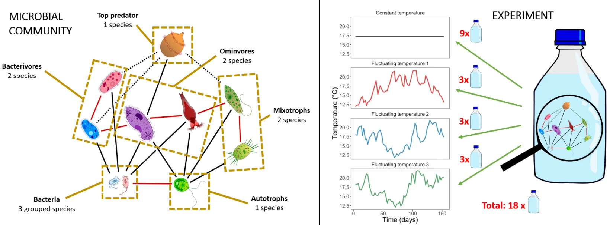
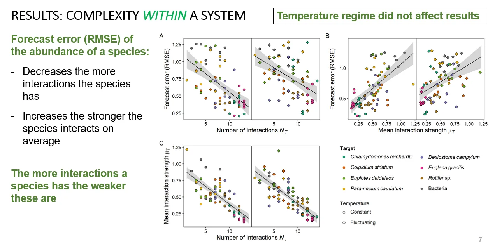
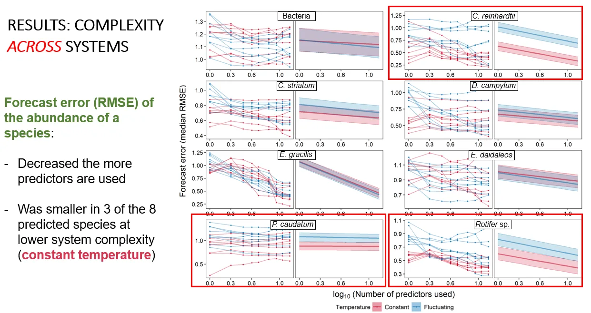

```{=html}
<main>
```

::: {.rp-wrap}

<!-- Sibling-paper nav. `.rp-toc .list` is a flex column whose items are
     `display:block` links wrapping inline spans, so it stays raw HTML. -->
```{=html}
<aside class="rp-toc" aria-label="Highlighted research">
<a class="back" href="../research.html">← Publications</a>
<div class="h">Highlighted research</div>
<ul class="list">
<li>
<a href="warmingFRpage.html">
<span class="meta">JAE 2019 · Elton Prize</span>
<span class="ti">Warming can destabilise predator–prey interactions</span>
</a>
</li>
<li class="current">
<a aria-current="page" href="EcoComplexEcoForecast.html">
<span class="meta">Ecology Letters 2022</span>
<span class="ti">Forecasting in the face of ecological complexity</span>
</a>
</li>
<li>
<a href="SamplingFreq.html">
<span class="meta">Ecosphere 2024</span>
<span class="ti">Sampling frequency and forecast skill</span>
</a>
</li>
</ul>
</aside>
```

::: {.rp-header}

::: {.titles}

<!-- `.rp-header .eyebrow` is a flex row of bare spans: as markdown its
     children would collapse into a single flex item. -->
```{=html}
<div class="eyebrow">
<span>Ecology Letters</span><span class="dot"></span>
<span>2022</span><span class="dot"></span>
<span>PhD chapter 1</span>
</div>
```

# Forecasting in the face of ecological complexity

<!-- `.lede` is a classed <p>; a fenced div would nest a bare <p> inside it and
     pick up the 19px/14px bare-<p> rule from site.css. -->
```{=html}
<p class="lede">
In a small microbial community, species with many but weak interactions are
easier to forecast than species with few strong ones. How connected a species is
turns out to be a forecasting trait in its own right.
</p>
```

:::

:::

<!-- `.rp-meta` is a flex row; its DOI link is a flex item styled as a button. -->
```{=html}
<div class="rp-meta">
<div class="authors"><strong>Daugaard U.</strong>, Munch S., Inauen D., Pennekamp F. &amp; Petchey O.</div>
<a class="doi-btn" href="https://doi.org/10.1111/ele.14070" target="_blank" rel="noopener">
doi: 10.1111/ele.14070 <span class="arrow">↗</span>
</a>
</div>
```

::: {.rp-body}

<!-- Pandoc's HTML writer special-cases a div whose class is exactly "section":
     it emits <section> and *drops* the class, which would take every
     `.rp-body .section ...` rule with it. The four section wrappers are
     therefore opened and closed as raw tags, like <main>. -->
```{=html}
<section class="section">
```

::: {.head}

<!-- `.num` holds bare text: as a fenced div it would gain a <p> wrapper. -->
```{=html}
<div class="num">01 · The question</div>
```

## Is ecological forecasting feasible given community complexity?

:::

::: {.text}

Ecology aims to forecast how populations and communities respond to change, and
complexity is usually cast as the obstacle. *Across* systems, more species and
more links are expected to mean less forecast skill. *Within* one system,
though, species differ in how many partners they interact with and how strongly,
and which end of that trade-off is easier to predict had not been tested.

<!-- <figure>/ stay raw: markdown images are wrapped in a <p> or promoted
     to a Quarto figure with its own caption markup. -->
```{=html}
<figure class="rp-fig">

<figcaption>
<span class="lbl">Fig. 1</span>
Two senses of complexity. Across systems, more links are expected to erode
forecast skill. Within one system, the direction was an open question.
</figcaption>
</figure>
```

:::

```{=html}
</section>
```

```{=html}
<section class="section">
```

::: {.head}

```{=html}
<div class="num">02 · What we did</div>
```

## A microbial community, five months, two thermal regimes

:::

::: {.text}

We grew a tri-trophic aquatic microbial community of bacteria, algae, ciliates,
flagellates and a rotifer in eighteen bottles for 154 days. Nine sat at a
constant 17.3 °C; the other nine were split across three fluctuating series with
the same mean, variance and autocorrelation, one of them copied from a nearby
stream. We sampled three times a week, giving 66 abundance points per bottle,
measured by flow cytometry, imaging or manual counts depending on how big the
organism was.

```{=html}
<figure class="rp-fig">

<figcaption>
<span class="lbl">Fig. 2</span>
The community and the design. Left: the food web, from grouped bacteria up to a
single top predator. Right: one constant and three fluctuating temperature
series, and the eighteen bottles spread across them.
</figcaption>
</figure>
```

For each of eight target species we forecast abundance with *multiview
embedding*, an empirical dynamic modelling method: train on the first 44 time
points, predict the last 22, score the error. Separately, in an analysis of its
own rather than as a by-product of the forecasts, we used convergent
cross-mapping to find which variables influenced each target, and S-map
Jacobians to estimate how strongly they did so. Those two quantities, the number
of interactions and their mean strength, are what we mean by a species'
connectedness.

:::

```{=html}
</section>
```

```{=html}
<section class="section">
```

::: {.head}

```{=html}
<div class="num">03 · What we found</div>
```

## Generalists are easier to forecast than specialists

:::

::: {.text}

Forecast error fell as a species' number of interactions rose, and climbed as
their mean strength rose. The two run against each other: the more interactions
a species had, the weaker they were. Generalists, with many weak links, were
therefore the easiest to forecast and specialists the hardest. Neither relation
depended on the temperature regime.

```{=html}
<figure class="rp-fig">

<figcaption>
<span class="lbl">Fig. 3</span>
Forecast error (RMSE, lower is better) falls as a species' number of
interactions rises (A) and climbs with their mean strength (B); species with
more interactions interact more weakly (C). Constant (circles) and fluctuating
(diamonds) regimes give the same picture.
</figcaption>
</figure>
```

<!-- `.rp-pull` styles its own inline content directly; a fenced div would add
     a <p> between the box and its text. -->
```{=html}
<div class="rp-pull">
<strong>Connectedness is a predictability signature.</strong> Where a species
sits in the community accounts for about a third of the variation in forecast
error: a strong tendency, not a hard limit.
</div>
```

Model size mattered too: the more state variables a model used as predictors,
the lower its error, in all eight species. Fluctuating temperatures raised
forecast error for three of the eight (*C. reinhardtii*, *P. caudatum* and the
rotifer) but left the interaction patterns themselves untouched, which argues
against any universal law tying complexity to predictability.

```{=html}
<figure class="rp-fig">

<figcaption>
<span class="lbl">Fig. 4</span>
Median forecast error against the number of predictors used, species by species.
Error falls as models grow. Fluctuating temperatures cost skill in the three
boxed species and left the other five alone.
</figcaption>
</figure>
```

:::

```{=html}
</section>
```

```{=html}
<section class="section">
```

::: {.head}

```{=html}
<div class="num">04 · Why it matters</div>
```

## Predictability is structured by the community itself

:::

::: {.text}

A species' interactions are a forecasting trait. Estimating connectedness says
something about which parts of a community will be easy or hard to predict
before any forecasting is done, and so about where monitoring effort and model
attention are worth spending.

:::

```{=html}
</section>
```

:::

<!-- Citation block: `.lbl` and `.full` are a bare-text div and a classed <p>,
     and `.actions` is a flex row of button-styled links. -->
```{=html}
<aside class="rp-cite" aria-label="Full citation">
<div class="lbl">Cite this paper</div>
<p class="full">
<strong>Daugaard, U.</strong>, Munch, S., Inauen, D., Pennekamp, F. &amp; Petchey, O. (2022).
Forecasting in the face of ecological complexity: number and strength of species
interactions determine forecast skill in ecological communities.
<em>Ecology Letters</em>, 25, 1974–1985.
</p>
<div class="actions">
<a class="primary" href="https://doi.org/10.1111/ele.14070" target="_blank" rel="noopener">Read paper (open access) ↗</a>
<a href="https://doi.org/10.5281/zenodo.6524695" target="_blank" rel="noopener">Data + code ↗</a>
</div>
</aside>
```

<!-- Sibling navigation. The .rp-toc at the top of the page is a float and scrolls
     away, so without this the only route to the other two deep dives is back at
     the very top of a long page. The styling for it already existed in
     research-page.css (.rp-siblings); only the markup was missing. -->

```{=html}
<nav class="rp-siblings" aria-label="Other highlighted research">
<div class="h">Other highlighted research</div>
<div class="row">
<a class="sib" href="warmingFRpage.html">
<div class="meta">JAE 2019 · Elton Prize</div>
<h4>Warming can destabilise predator–prey interactions</h4>
<span class="chip">Read the deep dive →</span>
</a>
<a class="sib" href="SamplingFreq.html">
<div class="meta">Ecosphere 2024</div>
<h4>Sampling frequency and forecast skill</h4>
<span class="chip">Read the deep dive →</span>
</a>
</div>
</nav>
```

:::

```{=html}
</main>
```
