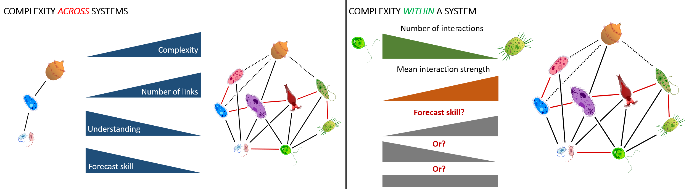
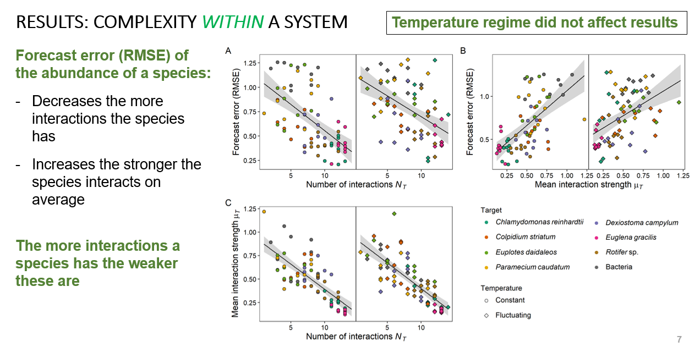
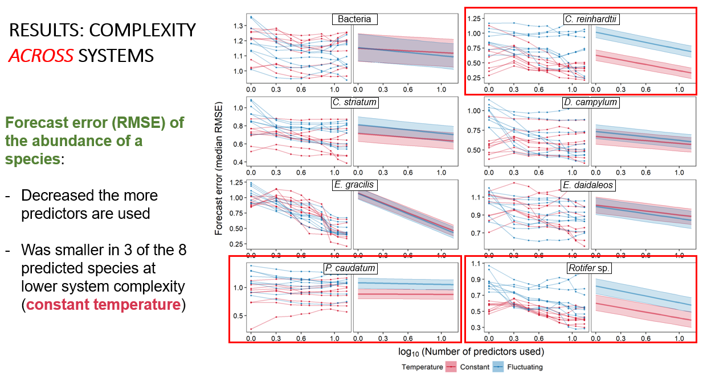

```{=html}
<script>document.body.dataset.page='research';document.body.dataset.screenLabel='03 Research / Ecological complexity';</script>

<span data-mount="bar"></span>

<main>
<div class="rp-wrap">

<aside class="rp-toc" aria-label="Highlighted research">
<a class="back" href="../research.html">← Research &amp; Publications</a>
<div class="h">Highlighted research</div>
<ul class="list">
<li>
<a href="warmingFRpage.html">
<span class="meta">JAE 2019 · Elton Prize</span>
<span class="ti">Warming destabilises predator–prey functional responses</span>
</a>
</li>
<li class="current">
<a aria-current="page" href="EcoComplexEcoForecast.html">
<span class="meta">Ecology Letters 2022</span>
<span class="ti">Forecasting in the face of ecological complexity</span>
</a>
</li>
<li>
<a href="SamplingFreq.html">
<span class="meta">Ecosphere 2024</span>
<span class="ti">Sampling frequency and forecast skill</span>
</a>
</li>
</ul>
</aside>

<header class="rp-header">
<div class="titles">
<div class="eyebrow">
<span>Ecology Letters</span><span class="dot"></span>
<span>2022</span><span class="dot"></span>
<span>PhD chapter 1</span>
</div>
<h1>Forecasting in the face of ecological complexity</h1>
<p class="lede">
In a small protist community, species with many but weak interactions are
forecast better than species with few strong ones. Connectedness, not just data
quality, sets a ceiling on how predictable a species is.
</p>
</div>
</header>

<div class="rp-meta">
<div class="authors"><strong>Daugaard U.</strong>, Munch S., Inauen D., Pennekamp F. &amp; Petchey O.</div>
<a class="doi-btn" href="https://doi.org/10.1111/ele.14070" target="_blank" rel="noopener">
doi: 10.1111/ele.14070 <span class="arrow">↗</span>
</a>
</div>

<article class="rp-body">

<section class="section">
<div class="head">
<div class="num">01 · The question</div>
<h2>Is ecological forecasting feasible given community complexity?</h2>
</div>
<div class="text">
<p>
Ecology aims to forecast how populations and communities will respond to change.
Real communities are messy, with many species interacting at once. We asked
whether a species' position in that web of interactions sets a ceiling on how
forecastable it is, and how much extra noise from a fluctuating environment
compounds that limit.
</p>
</div>
</section>

<section class="section">
<div class="head">
<div class="num">02 · What we did</div>
<h2>A protist community, five months, two thermal regimes</h2>
</div>
<div class="text">
<p>
We grew a community of eight aquatic protist taxa under two regimes with the
same long-run mean temperature: one held constant, the other fluctuating. The
experiment ran for about five months with regular video samples that gave us
abundance time series for every taxon.
</p>

<figure class="rp-fig">

<figcaption>
<span class="lbl">Fig. 1</span>
The microbial community and the two thermal regimes. Constant and fluctuating
temperatures share the same long-run mean.
</figcaption>
</figure>

<p>
For each species we fit empirical dynamic models on a training window and
forecast the held-out tail of the series, then scored the forecast against
truth. From the same models we extracted estimates of the number and strength
of each species' interactions: its connectedness.
</p>

<figure class="rp-fig">

<figcaption>
<span class="lbl">Fig. 2</span>
The forecasting workflow. Train on the early window, forecast the held-out
tail, score against truth.
</figcaption>
</figure>
</div>
</section>

<section class="section">
<div class="head">
<div class="num">03 · What we found</div>
<h2>Generalists are easier to forecast than specialists</h2>
</div>
<div class="text">
<p>
Forecast skill rose with the number of interactions a species had, and fell with
their mean strength. Generalists, with many weak interactions, were the most
forecastable. Specialists, with few strong interactions, were the least.
</p>

<figure class="rp-fig">

<figcaption>
<span class="lbl">Fig. 3</span>
Forecast skill rises with the number of interactions a species has and falls
with their mean strength. Generalists sit in the upper right.
</figcaption>
</figure>

<div class="rp-pull">
<strong>Connectedness is a predictability signature.</strong> Where a species
sits in the community sets a ceiling on how well it can be forecast, before
data quality or model choice enter the picture.
</div>

<p>
Fluctuating temperatures degraded forecast skill for some species but not
others. The community context, not just the environmental noise, decided which
species suffered.
</p>

<figure class="rp-fig">

<figcaption>
<span class="lbl">Fig. 4</span>
Effect of fluctuating temperatures on forecast skill. Some species hold their
skill; others lose it. Community position matters more than the environment
alone.
</figcaption>
</figure>
</div>
</section>

<section class="section">
<div class="head">
<div class="num">04 · Why it matters</div>
<h2>Predictability is structured by the community itself</h2>
</div>
<div class="text">
<p>
A species' interactions are a forecasting trait. Estimating connectedness can
tell us in advance which parts of a community will be easy or hard to predict,
and where monitoring effort and model attention are best spent.
</p>
</div>
</section>

</article>

<aside class="rp-cite" aria-label="Full citation">
<div class="lbl">Cite this paper</div>
<p class="full">
<strong>Daugaard, U.</strong>, Munch, S., Inauen, D., Pennekamp, F. &amp; Petchey, O. (2022).
Forecasting in the face of ecological complexity: number and strength of species
interactions determines forecast skill in ecological communities.
<em>Ecology Letters</em>, 25, 1659–1672.
</p>
<div class="actions">
<a class="primary" href="https://doi.org/10.1111/ele.14070" target="_blank" rel="noopener">Read paper (open access) ↗</a>
<a href="https://doi.org/10.5281/zenodo.6524695" target="_blank" rel="noopener">Data + code ↗</a>
</div>
</aside>

</div>
</main>

<span data-mount="foot"></span>
```
