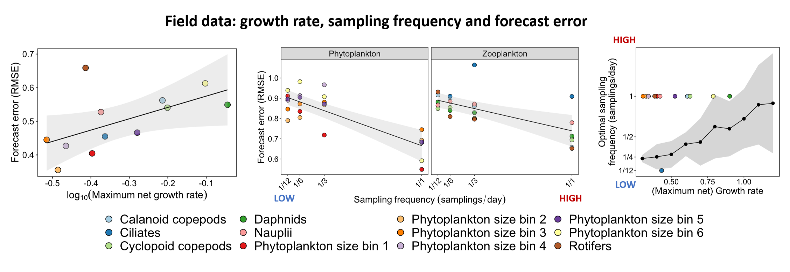
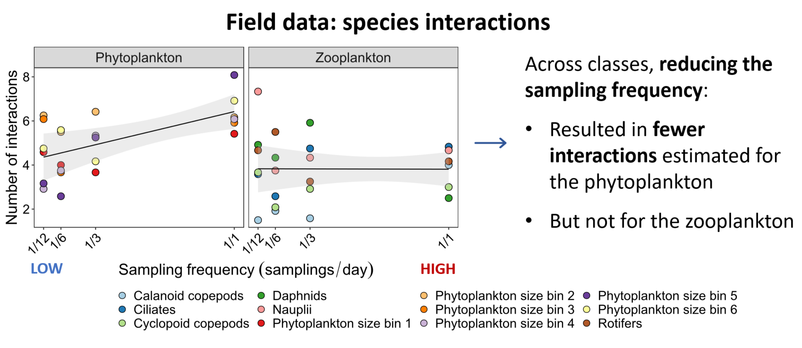

```{=html}
<script>document.body.dataset.page='research';document.body.dataset.screenLabel='03 Research / Sampling frequency';</script>

<span data-mount="bar"></span>

<main>
<div class="rp-wrap">

<aside class="rp-toc" aria-label="Highlighted research">
<a class="back" href="../research.html">← Research &amp; Publications</a>
<div class="h">Highlighted research</div>
<ul class="list">
<li>
<a href="warmingFRpage.html">
<span class="meta">JAE 2019 · Elton Prize</span>
<span class="ti">Warming destabilises predator–prey functional responses</span>
</a>
</li>
<li>
<a href="EcoComplexEcoForecast.html">
<span class="meta">Ecology Letters 2022</span>
<span class="ti">Forecasting in the face of ecological complexity</span>
</a>
</li>
<li class="current">
<a aria-current="page" href="SamplingFreq.html">
<span class="meta">Ecosphere 2024</span>
<span class="ti">Sampling frequency and forecast skill</span>
</a>
</li>
</ul>
</aside>

<header class="rp-header">
<div class="titles">
<div class="eyebrow">
<span>Ecosphere</span><span class="dot"></span>
<span>2024</span><span class="dot"></span>
<span>Monitoring design</span>
</div>
<h1>Using forecasts to improve monitoring in community ecology</h1>
<p class="lede">
As sampling frequency drops, forecasts deteriorate across every taxon of a long
lake-plankton record, and species interactions are estimated with systematic
bias. Forecast skill can be turned into a design tool for monitoring programs.
</p>
</div>
</header>

<div class="rp-meta">
<div class="authors"><strong>Daugaard U.</strong>, Merkli S., Merz E., Pomati F. &amp; Petchey O.L.</div>
<a class="doi-btn" href="https://doi.org/10.1002/ecs2.4786" target="_blank" rel="noopener">
doi: 10.1002/ecs2.4786 <span class="arrow">↗</span>
</a>
</div>

<article class="rp-body">

<section class="section">
<div class="head">
<div class="num">01 · The question</div>
<h2>How often is often enough?</h2>
</div>
<div class="text">
<p>
Long-term monitoring programs face a recurring choice: how often to sample.
Sampling too rarely may miss the dynamics that matter; sampling too often is
expensive. We asked whether forecast skill itself can guide that choice, both
in principle and on a real lake.
</p>
</div>
</section>

<section class="section">
<div class="head">
<div class="num">02 · What we did</div>
<h2>A simulated baseline and a real high-frequency lake</h2>
</div>
<div class="text">
<p>
We worked with two datasets. The first is a simulated community where the true
dynamics and interactions are known. The second is a high-frequency plankton
time series from Lake Greifensee, with measurements taken much more often than
standard monitoring.
</p>

<figure class="rp-fig">

<figcaption>
<span class="lbl">Fig. 1</span>
The two datasets and the thinning procedure: keep every <em>n</em>-th sample
to mimic a less frequent monitoring program, refit, and compare.
</figcaption>
</figure>

<p>
For each dataset we thinned the time series to mimic lower sampling rates,
refit forecasting models at every frequency, and compared the resulting forecast
skill and interaction estimates against the high-frequency reference.
</p>
</div>
</section>

<section class="section">
<div class="head">
<div class="num">03 · What we found</div>
<h2>Forecasts decay, and interactions are biased both ways</h2>
</div>
<div class="text">
<p>
Forecast skill dropped as sampling became less frequent, in every taxon of the
lake series. The steepest losses were in taxa with the fastest underlying
dynamics. Interactions estimated from the thinned series were systematically
biased: some inflated, some attenuated, relative to the high-frequency truth.
</p>

<figure class="rp-fig">

<figcaption>
<span class="lbl">Fig. 2</span>
Forecast skill across taxa as the dataset is thinned. Skill decays as
sampling frequency drops, with the steepest losses where dynamics are fastest.
</figcaption>
</figure>

<div class="rp-pull">
<strong>Frequency is informative, not just operational.</strong> The right
sampling cadence depends on the dynamics of the system being monitored. Faster
dynamics demand denser sampling.
</div>

<p>
In the simulated baseline, the optimal sampling frequency scaled cleanly with
growth rate. In the real lake the same rule did not transfer cleanly, because
community context shapes the relationship as well.
</p>

<figure class="rp-fig">

<figcaption>
<span class="lbl">Fig. 3</span>
Optimal sampling frequency scales with growth rate in the simulated
baseline. The same rule does not transfer cleanly to the lake; community
context matters too.
</figcaption>
</figure>
</div>
</section>

<section class="section">
<div class="head">
<div class="num">04 · Why it matters</div>
<h2>Forecast skill is a design tool, not just an outcome</h2>
</div>
<div class="text">
<p>
Monitoring programs can pilot their sampling cadence against forecast skill,
choosing the lowest frequency that preserves both prediction and inference.
That makes ecological monitoring cheaper to run, and the inferences drawn from
it more honest.
</p>
</div>
</section>

</article>

<aside class="rp-cite" aria-label="Full citation">
<div class="lbl">Cite this paper</div>
<p class="full">
<strong>Daugaard, U.</strong>, Merkli, S., Merz, E., Pomati, F. &amp; Petchey, O.L. (2024).
The dependence of forecasts on sampling frequency as a guide to optimizing monitoring
in community ecology. <em>Ecosphere</em>, 15, e4786.
</p>
<div class="actions">
<a class="primary" href="https://doi.org/10.1002/ecs2.4786" target="_blank" rel="noopener">Read paper (open access) ↗</a>
<a href="https://doi.org/10.5281/zenodo.10066786" target="_blank" rel="noopener">Data + code ↗</a>
</div>
</aside>

</div>
</main>

<span data-mount="foot"></span>
```
