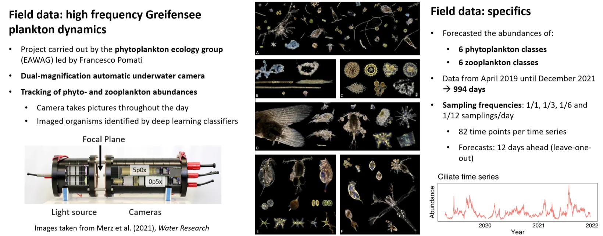
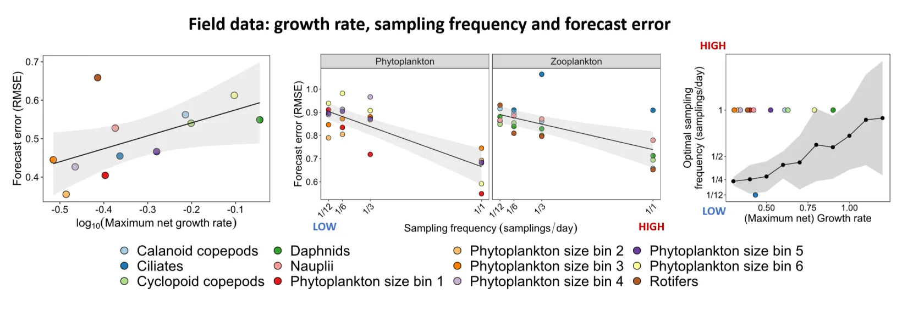
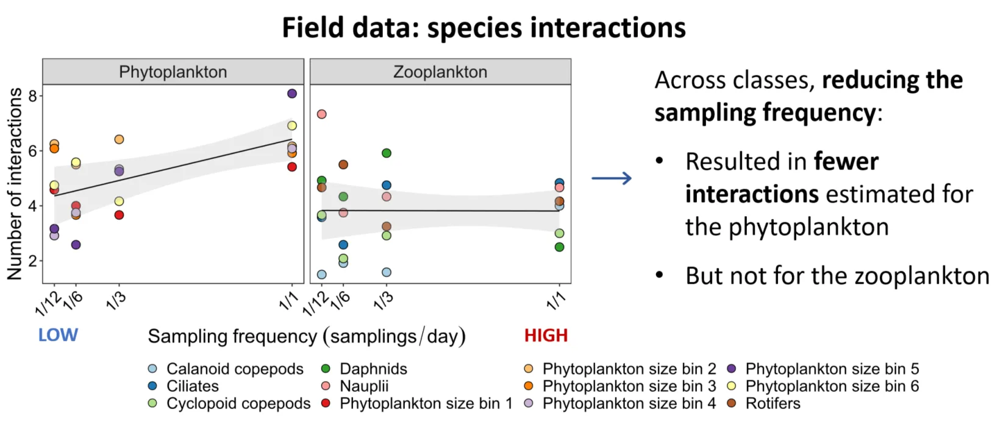

```{=html}
<main>
```

:::::::: {.rp-wrap}

<!-- Nav block stays raw HTML end to end. Quarto's bundled stylesheet styles the
     bare `aside` tag (font-size:.825rem plus a colour that the borders inherit),
     so this cannot become a fenced div; inside it, `.back` is inline-block and
     `.list` is a flex column of display:block links wrapping inline spans, all
     of which a <p> wrapper would break. -->
```{=html}
<aside class="rp-toc" aria-label="Highlighted research">
<a class="back" href="../research.html">← Research &amp; Publications</a>
<div class="h">Highlighted research</div>
<ul class="list">
<li>
<a href="warmingFRpage.html">
<span class="meta">JAE 2019 · Elton Prize</span>
<span class="ti">Warming can destabilise predator–prey interactions</span>
</a>
</li>
<li>
<a href="EcoComplexEcoForecast.html">
<span class="meta">Ecology Letters 2022</span>
<span class="ti">Forecasting in the face of ecological complexity</span>
</a>
</li>
<li class="current">
<a aria-current="page" href="SamplingFreq.html">
<span class="meta">Ecosphere 2024</span>
<span class="ti">Sampling frequency and forecast skill</span>
</a>
</li>
</ul>
</aside>
```

:::::: {.rp-header}
:::: {.titles}
```{=html}
<div class="eyebrow">
<span>Ecosphere</span><span class="dot"></span>
<span>2024</span><span class="dot"></span>
<span>PhD chapter 2</span>
</div>
```

# Using forecasts to improve monitoring in community ecology

```{=html}
<p class="lede">
As sampling frequency drops, forecasts get worse for almost every class of a
long lake-plankton record, and fewer interactions are recovered among the
phytoplankton. Turn that around, and forecast skill becomes a design tool for
monitoring programmes.
</p>
```
::::
::::::

:::::: {.rp-meta}
```{=html}
<div class="authors"><strong>Daugaard U.</strong>, Merkli S., Merz E., Pomati F. &amp; Petchey O.L.</div>
<a class="doi-btn" href="https://doi.org/10.1002/ecs2.4786" target="_blank" rel="noopener">
doi: 10.1002/ecs2.4786 <span class="arrow">↗</span>
</a>
```
::::::

:::::: {.rp-body}

<!-- The `<section class="section">` wrappers are opened and closed with raw
     HTML: pandoc's html5 writer rewrites any div carrying the class `section`
     into a bare <section> and drops the class, which would leave every
     `.rp-body .section ...` rule unmatched. Their contents are markdown. -->
```{=html}
<section class="section">
```
:::: {.head}
```{=html}
<div class="num">01 · The question</div>
```
## How often is often enough?
::::
:::: {.text}
Long-term monitoring programmes face a recurring choice: how often to sample.
Sampling too rarely may miss the dynamics that matter; sampling too often is
expensive. We asked whether forecast skill itself can guide that choice, both in
a controlled simulation and on a real lake.
::::
```{=html}
</section>

<section class="section">
```
:::: {.head}
```{=html}
<div class="num">02 · What we did</div>
```
## A simulated baseline and a real high-frequency lake
::::
:::: {.text}
We worked with two datasets. The first is a deliberately minimal baseline: a
single simulated population following a delayed logistic equation, where the
dynamics are known exactly and growth rate can be dialled up and down. The
second is a high-frequency plankton record from Lake Greifensee, where an
automated underwater camera images plankton every hour and neural-network
classifiers sort the imaged individuals into phytoplankton and zooplankton. That
gives six zooplankton classes; the phytoplankton we then split into six size
bins.

```{=html}
<figure class="rp-fig">

<figcaption>
<span class="lbl">Fig. 1</span>
The field data. A dual-magnification underwater camera images plankton hourly in
Lake Greifensee; classifiers sort them into six phytoplankton and six
zooplankton classes over 994 days, April 2019 to December 2021.
</figcaption>
</figure>
```

From the daily record we built sparser versions along two axes we kept
deliberately apart: lower sampling frequency at a fixed 82 time points, down to
one sample every twelve days, and fewer time points at daily frequency. At every
setting we refit the forecasts, then used convergent cross-mapping to re-detect
which classes were causally linked and S-map to re-estimate how strongly.
::::
```{=html}
</section>

<section class="section">
```
:::: {.head}
```{=html}
<div class="num">03 · What we found</div>
```
## Forecasts decay, and interaction estimates thin out
::::
:::: {.text}
Forecast error rose as sampling grew sparser, for eleven of the twelve plankton
classes; only the ciliates were forecast best from the sparsest series.
Phyto- and zooplankton lost skill at much the same rate. Faster-growing classes
were harder to forecast overall, though the evidence for that was weak.

```{=html}
<figure class="rp-fig">

<figcaption>
<span class="lbl">Fig. 2</span>
Forecast error (RMSE, lower is better) against growth rate (left) and sampling
frequency (centre). Right: optimal frequency rises with growth rate in the
simulation, while eleven of the twelve lake classes sit at daily sampling and
the ciliates alone at one sample every twelve days.
</figcaption>
</figure>
```

::: {.rp-pull}
```{=html}
<strong>Frequency is informative, not just operational.</strong> Growth rate
predicted the right cadence in the single-species simulation. In the lake it
predicted nothing: the densest sampling available was the best for eleven of
twelve classes.
```
:::

Sampling design also changed what the models said about who interacts with whom.
Coarser sampling left fewer interactions detected among the phytoplankton
classes, while the zooplankton estimates held on average, and mean interaction
strength moved for neither group. The true interactions are unknown, so the bias
cannot be measured directly. But since the forecasts were best at the densest
sampling, the counts are likely closest to right there, and undercounts
elsewhere.

```{=html}
<figure class="rp-fig">

<figcaption>
<span class="lbl">Fig. 3</span>
Interactions recovered against sampling frequency. Sampling less often costs the
phytoplankton classes interactions; the zooplankton estimates are unmoved.
</figcaption>
</figure>
```

Natural communities therefore seem to need denser sampling than a target's own
growth rate would suggest, plausibly because the cadence has to track the
fastest variable a target interacts with, not the target itself.
::::
```{=html}
</section>

<section class="section">
```
:::: {.head}
```{=html}
<div class="num">04 · Why it matters</div>
```
## Forecast skill is a design tool, not just an outcome
::::
:::: {.text}
Monitoring programmes can pilot their sampling cadence against forecast skill,
choosing the lowest frequency that preserves both prediction and inference. That
makes ecological monitoring cheaper to run, and the inferences drawn from it more
honest: a programme that samples too rarely will not only forecast worse, it will
also see a sparser interaction network than is really there.
::::
```{=html}
</section>
```

::::::

<!-- Citation block: `aside` again, plus `<p class="full">` (markdown cannot put
     a class on a paragraph) and `.actions`, a flex row of inline links. -->
```{=html}
<aside class="rp-cite" aria-label="Full citation">
<div class="lbl">Cite this paper</div>
<p class="full">
<strong>Daugaard, U.</strong>, Merkli, S., Merz, E., Pomati, F. &amp; Petchey, O.L. (2024).
The dependence of forecasts on sampling frequency as a guide to optimizing monitoring
in community ecology. <em>Ecosphere</em>, 15, e4786.
</p>
<div class="actions">
<a class="primary" href="https://doi.org/10.1002/ecs2.4786" target="_blank" rel="noopener">Read paper (open access) ↗</a>
<a href="https://doi.org/10.5281/zenodo.10066786" target="_blank" rel="noopener">Data + code ↗</a>
</div>
</aside>
```

<!-- Sibling navigation. The .rp-toc at the top of the page is a float and scrolls
     away, so without this the only route to the other two deep dives is back at
     the very top of a long page. The styling for it already existed in
     research-page.css (.rp-siblings); only the markup was missing. -->

```{=html}
<nav class="rp-siblings" aria-label="Other highlighted research">
<div class="h">Other highlighted research</div>
<div class="row">
<a class="sib" href="warmingFRpage.html">
<div class="meta">JAE 2019 · Elton Prize</div>
<h4>Warming can destabilise predator–prey interactions</h4>
<span class="chip">Read the deep dive →</span>
</a>
<a class="sib" href="EcoComplexEcoForecast.html">
<div class="meta">Ecology Letters 2022</div>
<h4>Forecasting in the face of ecological complexity</h4>
<span class="chip">Read the deep dive →</span>
</a>
</div>
</nav>
```

::::::::

```{=html}
</main>
```
