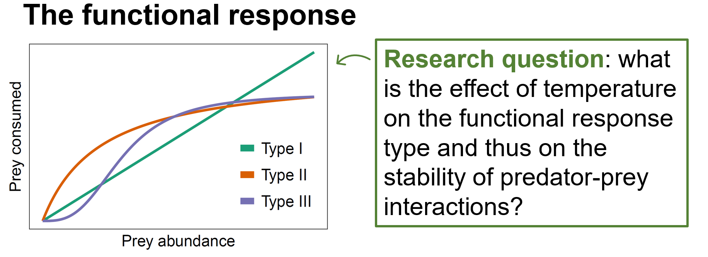
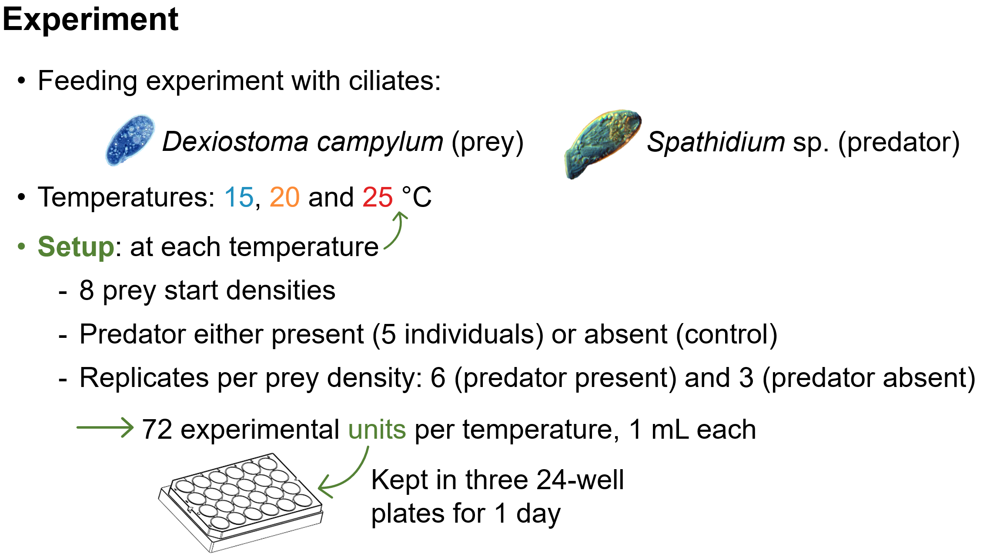
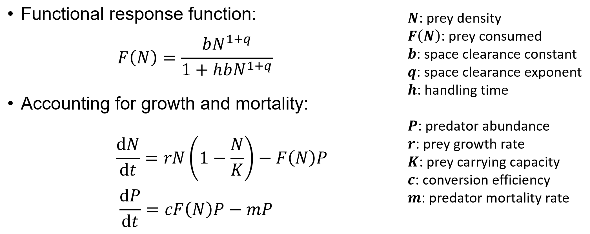

```{=html}
<main>
```

::: {.rp-wrap}

```{=html}
<aside class="rp-toc" aria-label="Highlighted research">
<a class="back" href="../research.html">← Research &amp; Publications</a>
<div class="h">Highlighted research</div>
<ul class="list">
<li class="current">
<a aria-current="page" href="warmingFRpage.html">
<span class="meta">JAE 2019 · Elton Prize</span>
<span class="ti">Warming destabilises predator–prey functional responses</span>
</a>
</li>
<li>
<a href="EcoComplexEcoForecast.html">
<span class="meta">Ecology Letters 2022</span>
<span class="ti">Forecasting in the face of ecological complexity</span>
</a>
</li>
<li>
<a href="SamplingFreq.html">
<span class="meta">Ecosphere 2024</span>
<span class="ti">Sampling frequency and forecast skill</span>
</a>
</li>
</ul>
</aside>
```

::: {.rp-header}

::: {.titles}

```{=html}
<div class="eyebrow">
<span>Journal of Animal Ecology</span><span class="dot"></span>
<span>2019</span><span class="dot"></span>
<span class="prize">★ 2019 Elton Prize</span>
</div>
```

# Warming can destabilise predator–prey functional responses

```{=html}
<p class="lede">
A three-month undergraduate project showing that warming can flip a predator's
functional response from Type III to Type II, and that this small shape change is
enough to drive the prey extinct in simulation.
</p>
```

:::

:::

```{=html}
<div class="rp-meta">
<div class="authors"><strong>Daugaard U.</strong>, Petchey O.L. &amp; Pennekamp F.</div>
<a class="doi-btn" href="https://doi.org/10.1111/1365-2656.13053" target="_blank" rel="noopener">
doi: 10.1111/1365-2656.13053 <span class="arrow">↗</span>
</a>
</div>
```

::: {.rp-body}

```{=html}
<section class="section">
```

::: {.head}

```{=html}
<div class="num">01 · The question</div>
```

## Does warming reshape the way predators eat their prey?

:::

::: {.text}

The *functional response* describes how much prey a single predator
consumes as prey density rises. Its shape (Type I, II or III) sets whether the
interaction is stabilising or destabilising. We asked whether a few degrees of
warming can change that shape.

:::

```{=html}
</section>

<section class="section">
```

::: {.head}

```{=html}
<div class="num">02 · What we did</div>
```

## A ciliate pair, 24 hours, three temperatures

:::

::: {.text}

We chose *Spathidium sp.*, a generalist ciliate predator, and its
preferred prey *Dexiostoma campylum*.

```{=html}
<figure class="rp-fig tight">

<figcaption>
<span class="lbl">Fig. 1</span>
The predator–prey pair. <em>Spathidium sp.</em> feeds on
<em>Dexiostoma campylum</em>.
</figcaption>
</figure>
```

We recorded both species over 24 hours at 15°, 20° and 25 °C, across a gradient
of starting prey densities, so the functional response could be reconstructed at
each temperature.

```{=html}
<figure class="rp-fig">

<figcaption>
<span class="lbl">Fig. 2</span>
Experimental design. A density gradient at each of three temperatures.
</figcaption>
</figure>
```

We then fit a population-dynamic model that explicitly contains the predator\'s
functional response. That gave us space clearance rate, handling time and density
dependence at each temperature, plus the predator\'s conversion efficiency.

```{=html}
<figure class="rp-fig">

<figcaption>
<span class="lbl">Fig. 3</span>
Model used for inference. Prey grow logistically; the predator consumes prey
through a functional response.
</figcaption>
</figure>
```

:::

```{=html}
</section>

<section class="section">
```

::: {.head}

```{=html}
<div class="num">03 · What we found</div>
```

## Type III at 15 and 20 °C, Type II at 25 °C

:::

::: {.text}

At the two cooler temperatures the functional response was Type III: it
accelerates at low prey densities, which gives prey a refuge when rare. At 25 °C
the response switched to Type II, with no acceleration phase.

```{=html}
<figure class="rp-fig">

<figcaption>
<span class="lbl">Fig. 4</span>
Estimated functional response. The Type III acceleration phase disappears at
25 °C.
</figcaption>
</figure>

<div class="rp-pull">
<strong>The destabilising consequence.</strong> Simulated long-run dynamics with
the fitted models show greater risk of prey extinction at higher temperatures,
with the largest jump at the Type III to Type II transition.
</div>

<figure class="rp-fig">

<figcaption>
<span class="lbl">Fig. 5</span>
Simulated dynamics. Prey-extinction probability rises with temperature.
</figcaption>
</figure>
```

Conversion efficiency also increased with warming, compounding the destabilising
effect.

:::

```{=html}
</section>

<section class="section">
```

::: {.head}

```{=html}
<div class="num">04 · Why it matters</div>
```

## Shape changes are usually missing from food-web models

:::

::: {.text}

Most climate-change food-web models hold the type of the functional response
fixed and only let temperature scale its parameters. The type itself can change,
with consequences that scaling alone will not capture. Future work should
investigate how often this happens, and how it propagates through multi-species
food webs.

:::

```{=html}
</section>
```

:::

```{=html}
<aside class="rp-cite" aria-label="Full citation">
<div class="lbl">Cite this paper</div>
<p class="full">
<strong>Daugaard, U.</strong>, Petchey, O.L. &amp; Pennekamp, F. (2019).
Warming can destabilize predator–prey interactions by shifting the functional response
from Type III to Type II. <em>Journal of Animal Ecology</em>, 88, 1575–1586.
</p>
<div class="actions">
<a class="primary" href="https://doi.org/10.1111/1365-2656.13053" target="_blank" rel="noopener">Read paper (open access) ↗</a>
<a href="https://zenodo.org/badge/latestdoi/186978107" target="_blank" rel="noopener">Data + code ↗</a>
<a href="https://www.britishecologicalsociety.org/publications/best-paper-by-an-early-career-researcher/elton-prize/" target="_blank" rel="noopener">About the Elton Prize ↗</a>
</div>
</aside>
```

:::

```{=html}
</main>
```
