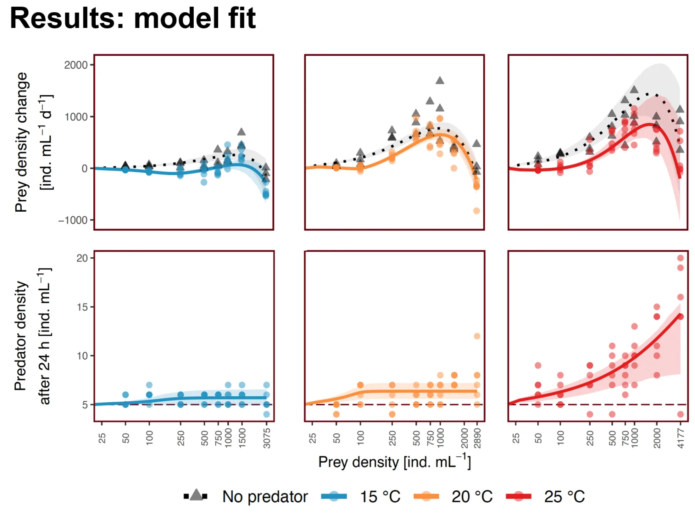
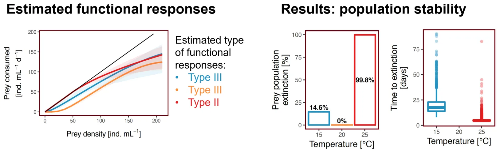

```{=html}
<main>
```

::: {.rp-wrap}

```{=html}
<aside class="rp-toc" aria-label="Highlighted research">
<a class="back" href="../research.html">← Publications</a>
<div class="h">Highlighted research</div>
<ul class="list">
<li class="current">
<a aria-current="page" href="warmingFRpage.html">
<span class="meta">JAE 2019 · Elton Prize</span>
<span class="ti">Warming can destabilise predator–prey interactions</span>
</a>
</li>
<li>
<a href="EcoComplexEcoForecast.html">
<span class="meta">Ecology Letters 2022</span>
<span class="ti">Forecasting in the face of ecological complexity</span>
</a>
</li>
<li>
<a href="SamplingFreq.html">
<span class="meta">Ecosphere 2024</span>
<span class="ti">Sampling frequency and forecast skill</span>
</a>
</li>
</ul>
</aside>
```

::: {.rp-header}

::: {.titles}

```{=html}
<div class="eyebrow">
<span>Journal of Animal Ecology</span><span class="dot"></span>
<span>2019</span><span class="dot"></span>
<span class="prize">★ 2019 Elton Prize</span>
</div>
```

# Warming can destabilise predator–prey interactions

```{=html}
<p class="lede">
A three-month undergraduate project showing that warming can flip a predator's
functional response from Type III to Type II, and that this one change of shape
is enough to drive the prey extinct in simulation.
</p>
```

:::

:::

```{=html}
<div class="rp-meta">
<div class="authors"><strong>Daugaard U.</strong>, Petchey O.L. &amp; Pennekamp F.</div>
<a class="doi-btn" href="https://doi.org/10.1111/1365-2656.13053" target="_blank" rel="noopener">
doi: 10.1111/1365-2656.13053 <span class="arrow">↗</span>
</a>
</div>
```

::: {.rp-body}

```{=html}
<section class="section">
```

::: {.head}

```{=html}
<div class="num">01 · The question</div>
```

## Does warming reshape the way predators eat their prey?

:::

::: {.text}

The *functional response* describes how much prey a single predator consumes as
prey density rises. Its shape matters for stability: a Type III response
accelerates at low prey density, so predation pressure eases when prey are rare,
and is generally considered the stabilising one. A Type II has no such phase. We
asked whether a few degrees of warming can change which shape a predator–prey
pair shows.

```{=html}
<figure class="rp-fig">

<figcaption>
<span class="lbl">Fig. 1</span>
The three functional response types, and the question we put to them. Only the
Type III accelerates at low prey density.
</figcaption>
</figure>
```

:::

```{=html}
</section>

<section class="section">
```

::: {.head}

```{=html}
<div class="num">02 · What we did</div>
```

## A ciliate pair, 24 hours, three temperatures

:::

::: {.text}

We paired the ciliate predator *Spathidium* sp. with its prey *Dexiostoma
campylum*, two species that co-occur in nature, and followed both over 24 hours
at 15, 20 and 25 °C. At each temperature we set up eight starting prey
densities, each with five predators or with none at all as a control. That came
to 72 one-millilitre wells per temperature, enough of a density gradient to
reconstruct the functional response at each of them.

```{=html}
<figure class="rp-fig">

<figcaption>
<span class="lbl">Fig. 2</span>
The experiment. Eight starting prey densities at each of three temperatures,
with the predator present or absent, scored after one day.
</figcaption>
</figure>
```

We then fitted a population-dynamic model built around a *generalised*
functional response, whose exponent *q* decides the type rather than being
assumed: *q* = 0 gives a Type II, *q* > 0 a Type III. Fitting it separately at
each temperature returned the space clearance constant, the handling time and
the exponent itself, along with the predator's conversion efficiency.

```{=html}
<figure class="rp-fig">

<figcaption>
<span class="lbl">Fig. 3</span>
The model we fitted. A generalised functional response with a free exponent
<em>q</em>, inside a predator–prey model with logistic prey growth.
</figcaption>
</figure>
```

:::

```{=html}
</section>

<section class="section">
```

::: {.head}

```{=html}
<div class="num">03 · What we found</div>
```

## Type III at 15 and 20 °C, Type II at 25 °C

:::

::: {.text}

At the two cooler temperatures the fitted exponent was positive: the response
accelerated at low prey density, leaving rare prey some respite. At 25 °C that
acceleration was gone and the response was Type II. Every other parameter of the
model shifted with temperature too, the conversion efficiency among them.

```{=html}
<figure class="rp-fig">

<figcaption>
<span class="lbl">Fig. 4</span>
Model fit. Top: change in prey density over 24 h with predators (circles) and
without (triangles). Bottom: predator density after 24 h, against a starting
density of five per millilitre (dashed).
</figcaption>
</figure>

<div class="rp-pull">
<strong>The destabilising consequence.</strong> Simulating the fitted models
forward drives the prey extinct in 99.8% of runs at 25 °C, against 14.6% at
15 °C and none at all at 20 °C. The jump arrives with the change in type, not
gradually with warming.
</div>

<figure class="rp-fig">

<figcaption>
<span class="lbl">Fig. 5</span>
Left: the estimated functional responses, Type III at 15 and 20 °C and Type II
at 25 °C. Right: how often the simulations drove the prey extinct, and how fast.
</figcaption>
</figure>
```

Conversion efficiency rose with warming as well, so it should not be assumed
temperature-independent either. It is not what destabilises the system, though:
pinning every parameter but the three functional response terms to its 20 °C
value leaves the extinction pattern in place, if weaker.

:::

```{=html}
</section>

<section class="section">
```

::: {.head}

```{=html}
<div class="num">04 · Why it matters</div>
```

## Shape changes are usually missing from food-web models

:::

::: {.text}

Models that project food webs under warming generally hold the type of the
functional response fixed and let temperature scale its parameters. The type
itself can change, and scaling alone will not capture what follows. How often
this happens, and how it propagates through a multi-species food web, is still
open.

:::

```{=html}
</section>
```

:::

```{=html}
<aside class="rp-cite" aria-label="Full citation">
<div class="lbl">Cite this paper</div>
<p class="full">
<strong>Daugaard, U.</strong>, Petchey, O.L. &amp; Pennekamp, F. (2019).
Warming can destabilize predator–prey interactions by shifting the functional response
from Type III to Type II. <em>Journal of Animal Ecology</em>, 88, 1575–1586.
</p>
<div class="actions">
<a class="primary" href="https://doi.org/10.1111/1365-2656.13053" target="_blank" rel="noopener">Read paper ↗</a>
<a href="https://doi.org/10.5281/zenodo.2864317" target="_blank" rel="noopener">Data + code ↗</a>
<a href="https://www.britishecologicalsociety.org/publications/best-paper-by-an-early-career-researcher/elton-prize/" target="_blank" rel="noopener">About the Elton Prize ↗</a>
</div>
</aside>
```

<!-- Sibling navigation. The .rp-toc at the top of the page is a float and scrolls
     away, so without this the only route to the other two deep dives is back at
     the very top of a long page. The styling for it already existed in
     research-page.css (.rp-siblings); only the markup was missing. -->

```{=html}
<nav class="rp-siblings" aria-label="Other highlighted research">
<div class="h">Other highlighted research</div>
<div class="row">
<a class="sib" href="EcoComplexEcoForecast.html">
<div class="meta">Ecology Letters 2022</div>
<h4>Forecasting in the face of ecological complexity</h4>
<span class="chip">Read the deep dive →</span>
</a>
<a class="sib" href="SamplingFreq.html">
<div class="meta">Ecosphere 2024</div>
<h4>Sampling frequency and forecast skill</h4>
<span class="chip">Read the deep dive →</span>
</a>
</div>
</nav>
```

:::

```{=html}
</main>
```
