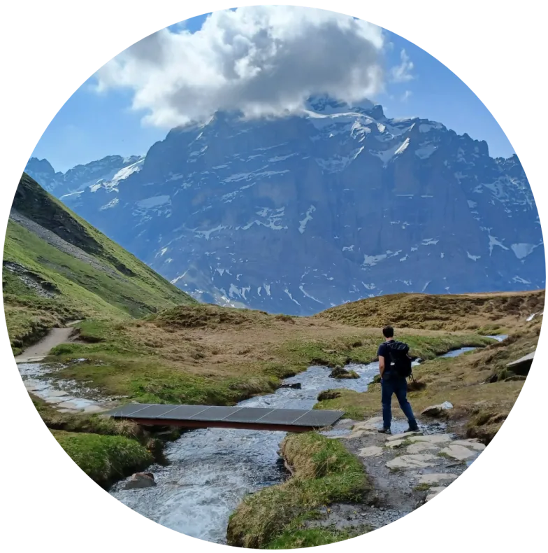

```{=html}
<main>
```

::: ct-layout

<!-- Left column: portrait with the profile links stacked underneath it, so the
     right column carries only the reasons to write and the address, and the
     whole page fits one screen again. -->

:::: ct-side

::: ct-portrait
```{=html}

```
:::

<!-- Grouped by what the visitor came to do rather than listed flat: the five
     links are not equivalent, and an undifferentiated pill row asks the reader
     to work out which is which. The group name sits on the same line as its
     chips and carries the heading job itself, so there is no section title. -->

```{=html}
<div class="ct-routes">
<div class="row">
<div class="k">Papers</div>
<div class="ct-links">
<a href="https://scholar.google.ch/citations?user=JI10T7QAAAAJ" target="_blank" rel="noopener">Google Scholar</a>
<a href="https://orcid.org/0000-0003-4092-717X" target="_blank" rel="noopener">ORCID</a>
<a href="https://www.webofscience.com/wos/author/record/AFC-9360-2022" target="_blank" rel="noopener">Web of Science</a>
</div>
</div>
<div class="row">
<div class="k">Code</div>
<div class="ct-links">
<a href="https://github.com/duriah" target="_blank" rel="noopener">GitHub</a>
</div>
</div>
<div class="row">
<div class="k">Network</div>
<div class="ct-links">
<a href="https://www.linkedin.com/in/daugaarduriah/" target="_blank" rel="noopener">LinkedIn</a>
</div>
</div>
</div>
```

::::

<!-- Title and body share one grid cell so the right column starts flush with the
     top of the portrait. As two cells in a two-row grid they were sized against
     the taller left column, which pushed the title down its row. -->

:::: ct-main

::: ct-title
# Contact {.page-title}
:::

::: ct-body

<!-- ## open to -->

```{=html}
<p class="ct-open">
Happy to talk about ecological forecasting, microbiome and sequencing data, or
reproducible analysis pipelines. Questions about any of the papers are always
welcome.
</p>
```

## email

<!-- .ct-email is a display:block link styled as its own line; as markdown it
     would land inside a <p>, which changes its inherited line-height. The
     .ct-cta and .ct-links rows below are flex containers whose children have to
     be the anchors themselves; a <p> would collapse each row into one item. -->

```{=html}
<a class="ct-email" href="mailto:uriah.daugaard@outlook.com">
uriah.daugaard@outlook.com
</a>
```

```{=html}
<div class="ct-cta">
<a class="btn" href="mailto:uriah.daugaard@outlook.com">Send email <span class="arrow">↗</span></a>
<a class="btn ghost" href="assets/docs/CV_long.pdf" target="_blank" rel="noopener">CV (pdf) <span class="arrow">↗</span></a>
</div>
```

## based in

```{=html}
<div class="ct-where">Zurich, Switzerland</div>
```

:::

::::

:::

```{=html}
</main>
```
