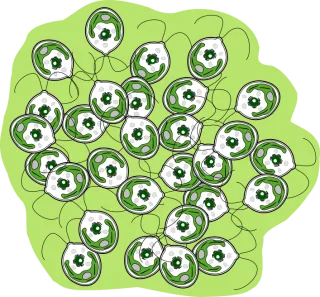
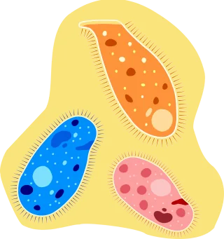
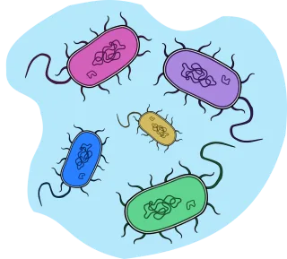

```{=html}
<main id="main">
```

<!-- Hero -->

::: {.home-hero}

```{=html}
<div class="plates plates-tight">
<figure class="plate">

<figcaption class="lbl" aria-hidden="true"><b>C. reinhardtii aggregate</b></figcaption>
</figure>
<figure class="plate">

<figcaption class="lbl" aria-hidden="true"><b>D. nasutum &middot; D. campylum &middot; C. striatum</b></figcaption>
</figure>
<figure class="plate">

<figcaption class="lbl" aria-hidden="true"><b>Bacterial community</b></figcaption>
</figure>
</div>
```

# Uriah Daugaard {.name}

```{=html}
<div class="script">bioinformatics &middot; ecology &middot; pipelines</div>
<div class="phd-line">PhD in Ecology<span class="dot">&middot;</span>MSc in Biostatistics</div>

<p class="tagline">
My work spans <em>bioinformatics</em>, <em>microbiome biology</em>, <em>ecological modelling</em>
and <em>forecasting</em>, <em>statistics</em> and <em>machine learning</em>. I turn sequencing and time series
data into models of how living systems behave.
</p>
```

::: {.home-bio}

```{=html}
<span class="eyebrow">a short bio</span>
```

I work as a computational ecologist at [**Cybiome**](https://cybiome.com){.inline target="_blank" rel="noopener"}
(Basel, Switzerland, 2025 to 2027), where I build bioinformatics pipelines and predictive models for microbiome questions.

Before that I did a PhD in ecology at the University of Zurich
(Petchey lab, 2020 to 2024) with a thesis on ecological forecasting,
an MSc in Biostatistics at UZH, and a BSc in Biology and Environmental Sciences.

:::

:::

<!-- Now + Selected publications -->

::: {.home-grid}

```{=html}
<div>
```

## What I\'m working on

```{=html}
<div class="sub">currently on the bench</div>
<div class="kv">
<div class="row">
<div class="k">Amplicon</div>
<div class="v">
<span>filtering + denoising</span>
<span>taxonomy</span>
<span>community structure</span>
<span>function</span>
<span>pathogenicity</span>
</div>
</div>
<div class="row">
<div class="k">Genomes</div>
<div class="v">
<span>assembly + annotation</span>
<span>phylogeny</span>
<span>ecological niche</span>
<span>metabolic capacity</span>
<span>secondary metabolites</span>
<span>biosafety</span>
</div>
</div>
<div class="row">
<div class="k">Analysis</div>
<div class="v">
<span>machine learning</span>
<span>feature selection</span>
<span>ecological forecasting</span>
<span>community modelling</span>
<span>network analysis</span>
</div>
</div>
<div class="row">
<div class="k">Stack</div>
<div class="v">
<span>R</span>
<span>Python</span>
<span>Quarto</span>
<span>Docker</span>
<span>Git</span>
<span>HDF5</span>
</div>
</div>
</div>
<div class="more"><a href="projects.html">read more on the Work page →</a></div>
</div>
```

```{=html}
<div>
```

## Selected publications

```{=html}
<div class="sub">first or joint first author</div>

<article class="pub">
<div class="yr">2025</div>
<div class="body">
<span class="au">Limberger R., <strong>Daugaard U.</strong>, Choffat Y., Gupta A., Jelić M., Jyrkinen S., Krug R.M., Nohl S., Pennekamp F., van Moorsel S.J., Zheng X., Zuppinger-Dingley D. &amp; Petchey O.L.</span>
<span class="ti"> Mixed evidence for species diversity affecting ecological forecasts in constant versus declining light.</span>
<span class="vn"> Global Change Biology, 31, e70364.</span>
<span class="ja">joint first</span>
<div class="links">
<a href="https://doi.org/10.1111/gcb.70364" target="_blank" rel="noopener">doi</a>
<a href="https://doi.org/10.5281/zenodo.15106928" target="_blank" rel="noopener">data + code</a>
</div>
</div>
</article>

<article class="pub">
<div class="yr">2024</div>
<div class="body">
<span class="au"><strong>Daugaard U.</strong>, Merkli S., Merz E., Pomati F. &amp; Petchey O.L.</span>
<span class="ti"> The dependence of forecasts on sampling frequency as a guide to optimizing monitoring in community ecology.</span>
<span class="vn"> Ecosphere, 15, e4786.</span>
<div class="links">
<a href="https://doi.org/10.1002/ecs2.4786" target="_blank" rel="noopener">doi</a>
<a href="https://doi.org/10.5281/zenodo.10066786" target="_blank" rel="noopener">data + code</a>
</div>
</div>
</article>

<article class="pub">
<div class="yr">2022</div>
<div class="body">
<span class="au"><strong>Daugaard U.</strong>, Munch S., Inauen D., Pennekamp F. &amp; Petchey O.L.</span>
<span class="ti"> Forecasting in the face of ecological complexity: number and strength of species interactions determine forecast skill in ecological communities.</span>
<span class="vn"> Ecology Letters, 25, 1974-1985.</span>
<div class="links">
<a href="https://doi.org/10.1111/ele.14070" target="_blank" rel="noopener">doi</a>
<a href="https://doi.org/10.5281/zenodo.6524695" target="_blank" rel="noopener">data + code</a>
</div>
</div>
</article>

<div class="more"><a href="research.html">full publication list and peer review →</a></div>
</div>
```

:::

<!-- Quick links -->

::: {.home-links}

```{=html}
<a href="https://www.linkedin.com/in/daugaarduriah/" target="_blank" rel="noopener">LinkedIn</a>
<a href="https://github.com/duriah" target="_blank" rel="noopener">GitHub</a>
<a href="https://orcid.org/0000-0003-4092-717X" target="_blank" rel="noopener">ORCID</a>
<a href="https://scholar.google.ch/citations?user=JI10T7QAAAAJ" target="_blank" rel="noopener">Google Scholar</a>
<a href="assets/docs/CV_long.pdf" target="_blank" rel="noopener">CV (pdf)</a>
<a href="mailto:uriah.daugaard@outlook.com">email</a>
```

:::

```{=html}
</main>
```
