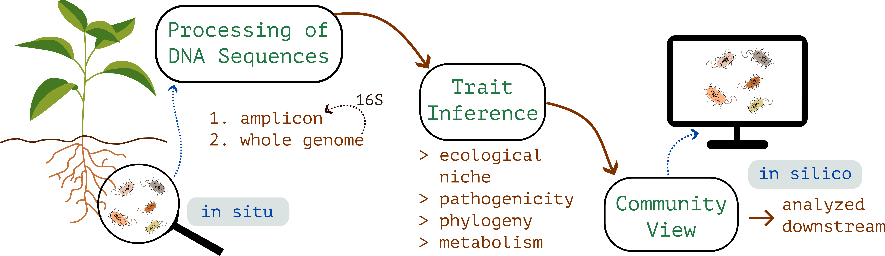

```{=html}
<main>
```

::: {.pj-header}
```{=html}
<div class="titles">
```

# Projects {.page-title}

```{=html}
<div class="page-sub">what I currently do</div>
</div>
```

<!-- `.page-sub` above and `.lead` below stay raw: a fenced div would wrap their
     bare text in a <p>, and site.css styles bare <p> (19px/1.6 + 14px margin).
     Pandoc also cannot put a class on a markdown paragraph, so `.lead` has to
     keep its own <p class="lead"> tag. -->

```{=html}
<p class="lead">
My work at Cybiome has two halves. First, the <em>pipelines</em> that take raw sequencing data
and turn it into a structured view of a microbial community. Second, the <em>models</em>
that run on that view and answer ecological questions about it. I join the two halves into
an integrated workflow (R, Python, containers), so that one piece flows into the&nbsp;next.
</p>
```
:::

<!-- Half 1: Pipelines -->

<!-- The leading `.section` class is not styling: it tells pandoc's HTML5 writer
     to emit this div as a real <section> (and is then dropped from the class
     list, so the element renders as <section class="pj-section">). It has to
     stay a <section>, because Quarto's bootstrap bundle carries
     `#quarto-content section:first-of-type h2:first-of-type{margin-top:1rem}`,
     which outranks `.pj-section .head h2{margin:0}` on the first section's
     heading. Turning this into a plain <div> drops that 1rem and moves the
     whole page up by 12px. -->

::: {.section .pj-section}

::: {.head}
```{=html}
<div class="num">i</div>
```

## Pipelines
:::

::: {.pj-intro}
Two pipelines: one for amplicon sequencing, one for whole genome bacterial sequencing.
They produce structurally different data, broad and shallow on one side, deep and per
strain on the other, but they are linked. Amplicon ASVs can be matched back to genomes
from the genome pipeline, so an amplicon survey can pull down the genome derived traits
of the organisms it found.

```{=html}
<figure aria-hidden="true">

<figcaption>fig. i &middot; from soil to community view</figcaption>
</figure>
```
:::

::: {.pj-grid}

::: {.pj-card}
### Amplicon

```{=html}
<div class="tag">marker gene · 16S &amp; ITS</div>
```

Marker gene reads from soil, root, gut and water samples. Bacterial 16S
and fungal ITS, with hash based deterministic ASV identifiers so the same
microbe carries the same ID across projects.

- [Quality]{.k}[DADA2 with automated denoising parameter selection]{}
- [Taxonomy]{.k}[community structure, abundance, predicted function]{}
- [Pathogenicity]{.k}[MBPD reference flags for 16S]{}
- [Fungi]{.k}[FungalTraits and FUNGuild trait + guild assignment]{}
- [Interop]{.k}[BIOM exchange with QIIME2 and mothur]{}
:::

::: {.pj-card}
### Whole genome

```{=html}
<div class="tag">per strain · bacterial</div>
```

Bacterial genomes from raw reads, pre assembled contigs, or pre annotated genomes.
Each strain leaves the pipeline with a multi facet trait profile and a standalone
HTML report including a circular genome map. 16S extracted out, feeding the
amplicon pipeline back.

- [Phylogeny]{.k}[BLAST against curated 16S references]{}
- [Niche]{.k}[GenomeSPOT physiology, gRodon2 growth rate]{}
- [Metabolism]{.k}[genome scale metabolic models, MEMOTE checked]{}
- [Sec. metabolites]{.k}[antiSMASH biosynthetic gene clusters]{}
- [Biosafety]{.k}[StarAMR, VFDB, MBPD, k-mer ML]{}
:::

:::

:::

<!-- Half 2: Models -->

<!-- `.section` here for the same reason as above: keep the element a <section>
     so the two halves stay `section:first-of-type` / `:nth-of-type(2)`. -->

::: {.section .pj-section}

::: {.head}
```{=html}
<div class="num">ii</div>
```

## Models on top
:::

::: {.pj-intro}
The questions sit downstream of the pipeline output. The application is agriculture and
microbiome biology: disease pressure on a crop, soil health under different management,
what assembles when, how strongly any of it predicts the outcome we care about. The
unifying frame is ecological. The methods range from statistical machine learning to
community level mechanistic modelling.

```{=html}
<figure aria-hidden="true">
<svg viewBox="0 0 360 260" xmlns="http://www.w3.org/2000/svg">
<defs>
<marker id="arr-md" viewBox="0 0 10 10" refX="9" refY="5" markerWidth="6" markerHeight="6" orient="auto">
<path d="M0,0 L10,5 L0,10" fill="none" stroke="currentColor" stroke-width="1.2" stroke-linecap="round" stroke-linejoin="round"/>
</marker>
</defs>
<g fill="none" stroke="currentColor" stroke-width="1.2" font-family="'JetBrains Mono',ui-monospace,monospace" font-size="10">
<rect x="95" y="6" width="170" height="28" rx="4"/>
<text x="180" y="24" text-anchor="middle" fill="#1f3a2f" stroke="none">community view</text>
<path d="M150 34 Q 70 50 65 86" marker-end="url(#arr-md)"/>
<line x1="180" y1="34" x2="180" y2="86" marker-end="url(#arr-md)"/>
<path d="M210 34 Q 290 50 295 86" marker-end="url(#arr-md)"/>
<rect x="15" y="90" width="100" height="40" rx="4"/>
<text x="65" y="108" text-anchor="middle" fill="#1f3a2f" stroke="none">predictive</text>
<text x="65" y="122" text-anchor="middle" fill="currentColor" stroke="none" font-size="9" opacity=".7">XGBoost · RF</text>
<rect x="130" y="90" width="100" height="40" rx="4"/>
<text x="180" y="108" text-anchor="middle" fill="#1f3a2f" stroke="none">mechanistic</text>
<text x="180" y="122" text-anchor="middle" fill="currentColor" stroke="none" font-size="9" opacity=".7">GSMM · FBA</text>
<rect x="245" y="90" width="100" height="40" rx="4"/>
<text x="295" y="108" text-anchor="middle" fill="#1f3a2f" stroke="none">time series</text>
<text x="295" y="122" text-anchor="middle" fill="currentColor" stroke="none" font-size="9" opacity=".7">EDM · state-space</text>
<path d="M65 130 Q 65 170 150 184" marker-end="url(#arr-md)"/>
<line x1="180" y1="130" x2="180" y2="184" marker-end="url(#arr-md)"/>
<path d="M295 130 Q 295 170 210 184" marker-end="url(#arr-md)"/>
<rect x="95" y="188" width="170" height="28" rx="4"/>
<text x="180" y="206" text-anchor="middle" fill="#1f3a2f" stroke="none">reports + figures</text>
</g>
</svg>
<figcaption>fig. placeholder &middot; methods schema</figcaption>
</figure>
```
:::

::: {.pj-method}

::: {.col}
### Predictive

```{=html}
<div class="tag">gradient boosting · ensembles</div>
```

XGBoost, random forest, regularised regression, stacked ensembles. The
interesting feature engineering question is trait based versus OTU based:
collapse the community into functional, metabolic and ecological trait
profiles built from genome derived traits. Trait based generalises better
to the realistic case where the test set contains microbes the training
set has not seen. Interpretation through SHAP.
:::

::: {.col}
### Mechanistic

```{=html}
<div class="tag">GSMM · community FBA</div>
```

Genome scale metabolic models for individual strains, reconstructed
from annotated genomes. Community level metabolic modelling
(SMETANA, MICOM) for how strains interact through their shared and
exchanged metabolites. Per organism flux similarity networks give
a graph view of metabolic relationships within a community.
:::

::: {.col}
### Time series

```{=html}
<div class="tag">EDM · Bayesian state-space</div>
```

Empirical dynamic modelling for nonparametric forecasting and
attractor reconstruction. Bayesian state space models when we want
to put a generative story on top of a noisy series. The signature
from the PhD years, still in active use here.
:::

:::

::: {.pj-out}
#### outputs

<!-- <b> is kept literally: `**x**` renders as <strong>, and the rule that
     styles these labels is `.pj-out ul li b`. -->

- <b>Quarto reports.</b> HTML and PDF, reproducible end to end.
- <b>Interactive figures.</b> embedded htmlwidgets, Observable.
- <b>Technical microbiome reports.</b> English and German, audience tuned.
:::

:::

```{=html}
<div class="pj-wayfind">
The peer reviewed work behind some of this lives on
<a href="research.html">Research &amp; Publications</a>.
Method demos you can poke at live on <a href="lab.html">Lab</a>.
</div>
```

```{=html}
</main>
```
