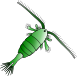
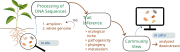

```{=html}
<main id="main">
```

<!-- Section rail. Shared with Research: the styles live in site.css and the
     scrollspy in site.js, which binds to `.rs-toc` and reads these hrefs. The ids
     are `sec-`-prefixed because Quarto also derives an id from each H2
     ("ecological-forecasting", …) and the two would collide. It is
     position:fixed, so its place in the DOM is a reading-order choice only. -->

```{=html}
<nav class="rs-toc" aria-label="On this page">
<ul>
<li class="top"><a href="#sec-header"><span class="t">Work</span><span class="tick"></span></a></li>
<li><a href="#sec-forecasting"><span class="t">Forecasting</span><span class="tick"></span></a></li>
<li><a href="#sec-microbiome"><span class="t">Microbiome</span><span class="tick"></span></a></li>
<li><a href="#sec-modelling"><span class="t">Modelling</span><span class="tick"></span></a></li>
</ul>
</nav>
```

::: {#sec-header .page-head}
```{=html}
<div class="titles">
```

# Work {.page-title}

```{=html}
</div>
```

<!-- `.lead` below stays raw: a fenced div would wrap its bare text in a <p>,
     and site.css styles bare <p> (19px/1.6 + 14px margin). Pandoc also cannot
     put a class on a markdown paragraph, so `.lead` has to keep its own
     <p class="lead"> tag. -->

```{=html}
<p class="lead">
As a bioinformatician and computational ecologist I build the pipelines that turn raw
sequencing data into a structured view of a biological community, and the models that run
on that view. The questions at the other end are ecological and mostly applied: how a
community is assembled, how it responds to stress, and how far ahead its behaviour can be
predicted.
</p>
```
:::

<!-- i · Ecological forecasting -->

<!-- The leading `.section` class is not styling: it tells pandoc's HTML5 writer
     to emit this div as a real <section> (and is then dropped from the class
     list, so the element renders as <section class="pj-section">). Every block
     below is a <section> for the same reason, which is also what makes
     `.pj-section + .pj-section` draw the dividers between them. -->

::: {#sec-forecasting .section .pj-section}

::: {.head}
```{=html}
<div class="num">i</div>
```

::: {}
```{=html}
<div class="kicker">phd &middot; uzh, petchey lab &middot; 2020 to 2024</div>
```

## Ecological forecasting
:::
:::

::: {.pj-intro}
Ecology is often treated as a field that cannot be forecasted, and the complexity of natural
systems is the usual reason given. Across four chapters I tested which properties of a
community and its environment actually set the ceiling on forecast skill: the number and
strength of species interactions, growth rates and body sizes, diversity, sampling design,
and environmental stress. Most of them mattered, and complexity did not always hurt.

```{=html}
<figure>

<figcaption>copepod &middot; one of twelve plankton classes forecast in the greifensee record, ecosphere 2024</figcaption>
</figure>
```
:::

::: {.pj-method}

::: {.col}
### Experiments

```{=html}
<div class="tag">microcosms &middot; up to nine months</div>
```

Microbial communities under manipulated environmental conditions (temperature,
light, etc.) and species richness. Run for hundreds of microbial generations (up to nine months) and sampled at high frequency.
Additionally, a high-frequency lake plankton record.
:::

::: {.col}
### Forecasting

```{=html}
<div class="tag">edm &middot; arima &middot; rf &middot; rnn</div>
```

Empirical dynamic modelling as the main approach, with ARIMA, random forests and
recurrent networks as comparators, so a result about forecast skill was never a
result about one method. At 7.4 million models fitted in a single parameter sweep,
run tracking became part of the method.
:::

::: {.col}
### Interactions

```{=html}
<div class="tag">ccm &middot; marss</div>
```

Convergent cross mapping and multivariate autoregressive state-space models to
estimate which species affect which, and how strongly. Those counts and strengths
then became predictors of forecast skill in their own right.
:::

:::

```{=html}
<div class="pj-lbl">deeper dives</div>
<div class="pj-deep">
<a href="ResearchPages/EcoComplexEcoForecast.html">
<div class="thumb" style="background-image:url('assets/img/PhdChp1Fig1.jpg')"></div>
<div>
<div class="meta">Ecology Letters 2022</div>
<div class="ti">Forecasting in the face of ecological complexity</div>
</div>
</a>
<a href="ResearchPages/SamplingFreq.html">
<div class="thumb" style="background-image:url('assets/img/SamplingFreqPic.jpg')"></div>
<div>
<div class="meta">Ecosphere 2024</div>
<div class="ti">Sampling frequency and forecast skill</div>
</div>
</a>
</div>
```

:::

<!-- ii · Microbiome platform -->

::: {#sec-microbiome .section .pj-section}

::: {.head}
```{=html}
<div class="num">ii</div>
```

::: {}
```{=html}
<div class="kicker">cybiome, basel &middot; 2025 to 2027 &middot; sole developer</div>
```

## Microbiome platform
:::
:::

::: {.pj-intro .solo .figfull}
Two production pipelines and the models that run on their output, built as sole
developer: one for amplicon sequencing, one for whole-genome bacterial sequencing.
They produce structurally different data: broad and shallow on one side, deep and
per-strain on the other. They are linked, so that an amplicon survey can pull down
the genome-derived traits of the organisms it identifies. The questions downstream
are applied ones: disease pressure on a crop, soil health under different
management, how a community assembles over time.

```{=html}
<figure>

<figcaption>from a soil sample to a community view carrying per-organism traits</figcaption>
</figure>
```
:::

::: {.pj-grid}

::: {.pj-card}
### Amplicon pipeline

```{=html}
<div class="tag">marker gene · 16S &amp; ITS</div>
```

Marker-gene reads from soil, root, gut and water. 16S and ITS, with hash-based
ASV identifiers so the same microbe carries the same ID across projects.

- [Quality]{.k}[DADA2 with automated denoising parameter selection]{}
- [Taxonomy]{.k}[community structure, abundance, predicted function]{}
- [Pathogenicity]{.k}[MBPD reference flags for 16S]{}
- [Fungi]{.k}[FungalTraits and FUNGuild trait + guild assignment]{}
- [Interop]{.k}[BIOM exchange with QIIME2 and mothur]{}
:::

::: {.pj-card}
### Whole genome pipeline

```{=html}
<div class="tag">per strain · bacterial</div>
```

From raw reads, contigs or annotated genomes. Returns a trait profile per strain
plus a standalone HTML report with a circular genome map. 16S feeds back to the
amplicon pipeline.

- [Phylogeny]{.k}[BLAST against curated 16S references]{}
- [Niche]{.k}[GenomeSPOT physiology, gRodon2 growth rate]{}
- [Metabolism]{.k}[genome-scale metabolic models, MEMOTE checked]{}
- [Metabolites]{.k}[antiSMASH biosynthetic gene clusters]{}
- [Biosafety]{.k}[StarAMR, VFDB, MBPD, k-mer ML]{}
:::

:::

::: {.pj-foot}

::: {.pj-out}
#### stack

- <b>Languages.</b> Python and R, packaged per module.
- <b>Data.</b> one hierarchical HDF5 store, and a curated reference collection of 20,000 complete NCBI RefSeq genomes carried through the pipeline.
- <b>Build.</b> Docker, Git, Quarto.
- <b>Principles.</b> containerised modules with resolved dependencies, versioning and provenance on every result, an evolving schema, reproducible reruns.
:::

```{=html}
<div>
<div class="pj-lbl">poster</div>
<div class="pj-deep tall">
<a href="assets/docs/COUSIN_Poster_Cybiome_LLD_Italy_2026.pdf" target="_blank" rel="noopener">
<div class="thumb" style="background-image:url('assets/img/poster-cousin-2026.png');background-position:top center"></div>
<div>
<div class="meta">LLD Italy &middot; 2026</div>
<div class="ti">COUSIN: plant-microbiome contributions to crop resilience</div>
<span class="chip">Read the poster &#8599;</span>
</div>
</a>
</div>
</div>
```

:::

:::

<!-- iii · Modelling and inference -->

::: {#sec-modelling .section .pj-section}

::: {.head}
```{=html}
<div class="num">iii</div>
```

::: {}
```{=html}
<div class="kicker">across the work</div>
```

## Modelling and inference
:::
:::

::: {.pj-intro .solo}
The systems change, but the questions repeat: how to design a study so the effect
is estimable, and how much of what a model explains survives out of sample.
:::

::: {.pj-method .pairs}

::: {.col}
### Design and inference

```{=html}
<div class="tag">experimental design &middot; mixed models &middot; glms</div>
```

Factorial designs and power analyses, then
linear, generalised linear and mixed models, with validation and uncertainty part of
the answer. Applied, it becomes monitoring design: how much sampling a programme needs.
:::

::: {.col}
### Bayesian

```{=html}
<div class="tag">brms &middot; stan</div>
```

Bayesian inference for the cases where a point estimate is not the answer:
hierarchical models over grouped and repeated measures, priors that carry what is
already known, and posterior predictive checks to find where a model fails.
:::

::: {.col}
### Predictive

```{=html}
<div class="tag">feature engineering &middot; ensembles &middot; neural nets</div>
```

Feature engineering, gradient boosting, stacked ensembles
and neural networks, tuned and validated out of sample, interpreted with SHAP.
:::

::: {.col}
### Metabolic models

```{=html}
<div class="tag">carveme &middot; memote &middot; smetana &middot; micom</div>
```

Genome-scale reconstructions per strain, quality checked, then community flux
balance analysis for what strains exchange. Open-source solvers when needed.
:::

:::

<!-- Same foot as the microbiome section: the section's ledger on the left, a single
     pointer on the right. This one used to be an unnumbered coda of its own, which
     left the page with three sections and a headingless block hanging off the end. -->

::: {.pj-foot}

::: {.pj-out}
#### how the work is built

- <b>Reproducible by default.</b> version control in, Quarto out, end to end.
- <b>Data and code published.</b> archived alongside the first-author papers.
- <b>Built to be handed over.</b> containers, pinned versions, written protocols.
:::

```{=html}
<div>
<div class="pj-lbl">worked example</div>
<div class="pj-deep aside">
<a href="ResearchPages/warmingFRpage.html">
<div class="thumb" style="background-image:url('assets/img/warmingfig1.jpg')"></div>
<div>
<div class="meta">JAE 2019 &middot; Elton Prize</div>
<div class="ti">Fitting a functional response, and what warming does to it</div>
</div>
</a>
</div>
</div>
```

:::

:::

```{=html}
<div class="pj-wayfind">
Papers and abstracts are on <a href="research.html">Publications</a>.
Talks, posters and teaching on <a href="talks.html">Talks &amp; Teaching</a>.
</div>
```

```{=html}
</main>
```
