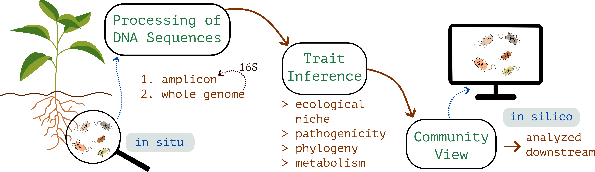

```{=html}
<script>document.body.dataset.page='projects';document.body.dataset.screenLabel='02 Projects';</script>

<span data-mount="bar"></span>

<main>
<div class="pj-header">
<div class="titles">
<h1 class="page-title">Projects</h1>
<div class="page-sub">what I currently do</div>
</div>
<p class="lead">
My work at Cybiome has two halves. First, the <em>pipelines</em> that take raw sequencing data
and turn it into a structured view of a microbial community. Second, the <em>models</em>
that run on that view and answer ecological questions about it. I join the two halves into
an integrated workflow (R, Python, containers), so that one piece flows into the&nbsp;next.
</p>
</div>

<!-- Half 1 — Pipelines -->
<section class="pj-section" data-screen-label="02a Pipelines">
<div class="head">
<div class="num">i</div>
<h2>Pipelines</h2>
</div>

<div class="pj-intro">
<p>
Two pipelines: one for amplicon sequencing, one for whole genome bacterial sequencing.
They produce structurally different data, broad and shallow on one side, deep and per
strain on the other, but they are linked. Amplicon ASVs can be matched back to genomes
from the genome pipeline, so an amplicon survey can pull down the genome derived traits
of the organisms it found.
</p>
<figure aria-hidden="true">

<figcaption>fig. i — from soil to community view</figcaption>
</figure>
</div>

<div class="pj-grid">
<article class="pj-card">
<h3>Amplicon</h3>
<div class="tag">marker gene · 16S &amp; ITS</div>
<p>
Marker gene reads from soil, root, gut and water samples. Bacterial 16S
and fungal ITS, with hash based deterministic ASV identifiers so the same
microbe carries the same ID across projects.
</p>
<ul>
<li><span class="k">Quality</span><span>DADA2 with automated denoising parameter selection</span></li>
<li><span class="k">Taxonomy</span><span>community structure, abundance, predicted function</span></li>
<li><span class="k">Pathogenicity</span><span>MBPD reference flags for 16S</span></li>
<li><span class="k">Fungi</span><span>FungalTraits and FUNGuild trait + guild assignment</span></li>
<li><span class="k">Interop</span><span>BIOM exchange with QIIME2 and mothur</span></li>
</ul>
</article>

<article class="pj-card">
<h3>Whole genome</h3>
<div class="tag">per strain · bacterial</div>
<p>
Bacterial genomes from raw reads, pre assembled contigs, or pre annotated genomes.
Each strain leaves the pipeline with a multi facet trait profile and a standalone
HTML report including a circular genome map. 16S extracted out, feeding the
amplicon pipeline back.
</p>
<ul>
<li><span class="k">Phylogeny</span><span>BLAST against curated 16S references</span></li>
<li><span class="k">Niche</span><span>GenomeSPOT physiology, gRodon2 growth rate</span></li>
<li><span class="k">Metabolism</span><span>genome scale metabolic models, MEMOTE checked</span></li>
<li><span class="k">Sec. metabolites</span><span>antiSMASH biosynthetic gene clusters</span></li>
<li><span class="k">Biosafety</span><span>StarAMR, VFDB, MBPD, k-mer ML</span></li>
</ul>
</article>
</div>
</section>

<!-- Half 2 — Models -->
<section class="pj-section" data-screen-label="02b Models">
<div class="head">
<div class="num">ii</div>
<h2>Models on top</h2>
</div>

<div class="pj-intro">
<p>
The questions sit downstream of the pipeline output. The application is agriculture and
microbiome biology: disease pressure on a crop, soil health under different management,
what assembles when, how strongly any of it predicts the outcome we care about. The
unifying frame is ecological. The methods range from statistical machine learning to
community level mechanistic modelling.
</p>
<figure aria-hidden="true">
<svg viewBox="0 0 360 260" xmlns="http://www.w3.org/2000/svg">
<defs>
<marker id="arr-md" viewBox="0 0 10 10" refX="9" refY="5" markerWidth="6" markerHeight="6" orient="auto">
<path d="M0,0 L10,5 L0,10" fill="none" stroke="currentColor" stroke-width="1.2" stroke-linecap="round" stroke-linejoin="round"/>
</marker>
</defs>
<g fill="none" stroke="currentColor" stroke-width="1.2" font-family="'JetBrains Mono',ui-monospace,monospace" font-size="10">
<rect x="95" y="6" width="170" height="28" rx="4"/>
<text x="180" y="24" text-anchor="middle" fill="#1f3a2f" stroke="none">community view</text>
<path d="M150 34 Q 70 50 65 86" marker-end="url(#arr-md)"/>
<line x1="180" y1="34" x2="180" y2="86" marker-end="url(#arr-md)"/>
<path d="M210 34 Q 290 50 295 86" marker-end="url(#arr-md)"/>
<rect x="15" y="90" width="100" height="40" rx="4"/>
<text x="65" y="108" text-anchor="middle" fill="#1f3a2f" stroke="none">predictive</text>
<text x="65" y="122" text-anchor="middle" fill="currentColor" stroke="none" font-size="9" opacity=".7">XGBoost · RF</text>
<rect x="130" y="90" width="100" height="40" rx="4"/>
<text x="180" y="108" text-anchor="middle" fill="#1f3a2f" stroke="none">mechanistic</text>
<text x="180" y="122" text-anchor="middle" fill="currentColor" stroke="none" font-size="9" opacity=".7">GSMM · FBA</text>
<rect x="245" y="90" width="100" height="40" rx="4"/>
<text x="295" y="108" text-anchor="middle" fill="#1f3a2f" stroke="none">time series</text>
<text x="295" y="122" text-anchor="middle" fill="currentColor" stroke="none" font-size="9" opacity=".7">EDM · state-space</text>
<path d="M65 130 Q 65 170 150 184" marker-end="url(#arr-md)"/>
<line x1="180" y1="130" x2="180" y2="184" marker-end="url(#arr-md)"/>
<path d="M295 130 Q 295 170 210 184" marker-end="url(#arr-md)"/>
<rect x="95" y="188" width="170" height="28" rx="4"/>
<text x="180" y="206" text-anchor="middle" fill="#1f3a2f" stroke="none">reports + figures</text>
</g>
</svg>
<figcaption>fig. placeholder — methods schema</figcaption>
</figure>
</div>

<div class="pj-method">
<div class="col">
<h3>Predictive</h3>
<div class="tag">gradient boosting · ensembles</div>
<p>
XGBoost, random forest, regularised regression, stacked ensembles. The
interesting feature engineering question is trait based versus OTU based:
collapse the community into functional, metabolic and ecological trait
profiles built from genome derived traits. Trait based generalises better
to the realistic case where the test set contains microbes the training
set has not seen. Interpretation through SHAP.
</p>
</div>
<div class="col">
<h3>Mechanistic</h3>
<div class="tag">GSMM · community FBA</div>
<p>
Genome scale metabolic models for individual strains, reconstructed
from annotated genomes. Community level metabolic modelling
(SMETANA, MICOM) for how strains interact through their shared and
exchanged metabolites. Per organism flux similarity networks give
a graph view of metabolic relationships within a community.
</p>
</div>
<div class="col">
<h3>Time series</h3>
<div class="tag">EDM · Bayesian state-space</div>
<p>
Empirical dynamic modelling for nonparametric forecasting and
attractor reconstruction. Bayesian state space models when we want
to put a generative story on top of a noisy series. The signature
from the PhD years, still in active use here.
</p>
</div>
</div>

<div class="pj-out">
<h4>outputs</h4>
<ul>
<li><b>Quarto reports.</b> HTML and PDF, reproducible end to end.</li>
<li><b>Interactive figures.</b> embedded htmlwidgets, Observable.</li>
<li><b>Technical microbiome reports.</b> English and German, audience tuned.</li>
</ul>
</div>
</section>

<div class="pj-wayfind">
The peer reviewed work behind some of this lives on
<a href="research.html">Research &amp; Publications</a>.
Method demos you can poke at live on <a href="lab.html">Lab</a>.
</div>
</main>
<span data-mount="foot"></span>
```
