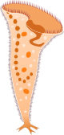

```{=html}
<script>document.body.dataset.page='research';document.body.dataset.screenLabel='03 Research & Publications';</script>

<span data-mount="bar"></span>

<main>
<div class="rs-header">
<div class="titles">
<h1 class="page-title">Research &amp; Publications</h1>
<div class="page-sub">the academic record</div>
</div>
<p class="lead">
Peer reviewed work, preprints, and the ongoing peer review record. The list below is
kept in sync at minor effort; for the live and canonical version, the
<a class="inline" href="https://scholar.google.ch/citations?user=JI10T7QAAAAJ" target="_blank" rel="noopener"><em>Google Scholar profile</em></a> is updated automatically.
</p>
</div>

<!-- Highlighted research cards -->
<section class="rs-cards" data-screen-label="03a Highlights">
<h2>Highlighted research</h2>
<div class="sub">deeper dives on three papers</div>
<div class="card-grid">
<a class="card" href="ResearchPages/warmingFRpage.html">
<div class="thumb" style="background-image:url('files/warmingfig1.jpg')"></div>
<div class="body">
<div class="meta">JAE 2019 · Elton Prize</div>
<h4>Warming can destabilize predator–prey functional responses</h4>
<p>Temperature shifts the functional response of a ciliate predator–prey pair from Type III to Type II at the highest tested temperature. Simulations show the destabilising consequences.</p>
<span class="chip">Find out more →</span>
</div>
</a>
<a class="card" href="ResearchPages/EcoComplexEcoForecast.html">
<div class="thumb" style="background-image:url('files/PhdChp1Fig1.jpg')"></div>
<div class="body">
<div class="meta">Ecology Letters 2022</div>
<h4>Forecasting in the face of ecological complexity</h4>
<p>Within and across communities, generalists (many but weak interactions) are forecast better than specialists. Number and strength of interactions sets the forecast skill ceiling.</p>
<span class="chip">Find out more →</span>
</div>
</a>
<a class="card" href="ResearchPages/SamplingFreq.html">
<div class="thumb" style="background-image:url('files/SamplingFreqPic.jpg')"></div>
<div class="body">
<div class="meta">Ecosphere 2024</div>
<h4>Sampling frequency and forecast skill</h4>
<p>Forecasts deteriorate predictably as sampling frequency drops, across all taxa in a long lake plankton record. Turning the tables, forecast skill becomes a guide to optimal monitoring design.</p>
<span class="chip">Find out more →</span>
</div>
</a>
</div>
</section>

<!-- Peer-reviewed -->
<section class="rs-block" data-screen-label="03b Peer reviewed">
<h2>Peer reviewed</h2>
<div class="sub">reverse chronological</div>

<article class="pub">
<div class="yr">2025</div>
<div class="body">
<span class="au">Limberger R., <strong>Daugaard U.</strong>, Choffat Y., Gupta A., Jelić M., Jyrkinen S., Krug R.M., Nohl S., Pennekamp F., van Moorsel S.J., Zheng X., Zuppinger-Dingley D. &amp; Petchey O.L.</span>
<span class="ti"> Mixed evidence for species diversity affecting ecological forecasts in constant versus declining light.</span>
<span class="vn"> Global Change Biology, 31, e70364.</span>
<span class="ja">joint first</span>
<div class="links">
<a href="https://doi.org/10.1111/gcb.70364" target="_blank" rel="noopener">doi</a>
</div>
</div>
</article>

<article class="pub">
<div class="yr">2024</div>
<div class="body">
<span class="au"><strong>Daugaard U.</strong>, Merkli S., Merz E., Pomati F. &amp; Petchey O.L.</span>
<span class="ti"> The dependence of forecasts on sampling frequency as a guide to optimizing monitoring in community ecology.</span>
<span class="vn"> Ecosphere, 15, e4786.</span>
<div class="links">
<a href="https://doi.org/10.1002/ecs2.4786" target="_blank" rel="noopener">doi</a>
<a href="https://doi.org/10.5281/zenodo.10066786" target="_blank" rel="noopener">data + code</a>
</div>
</div>
</article>

<article class="pub">
<div class="yr">2023</div>
<div class="body">
<span class="au">Limberger R., <strong>Daugaard U.</strong>, Gupta A., Krug R.M., Lemmen K.D., Van Moorsel S.J., et al.</span>
<span class="ti"> Functional diversity can facilitate the collapse of an undesirable ecosystem state.</span>
<span class="vn"> Ecology Letters, 26, 883-895.</span>
<div class="links">
<a href="https://doi.org/10.1111/ele.14217" target="_blank" rel="noopener">doi</a>
<a href="https://doi.org/10.5281/zenodo.7743866" target="_blank" rel="noopener">data</a>
<a href="https://doi.org/10.5281/zenodo.7744094" target="_blank" rel="noopener">code</a>
</div>
</div>
</article>

<article class="pub">
<div class="yr">2022</div>
<div class="body">
<span class="au"><strong>Daugaard U.</strong>, Munch S., Inauen D., Pennekamp F. &amp; Petchey O.</span>
<span class="ti"> Forecasting in the face of ecological complexity: number and strength of species interactions determines forecast skill in ecological communities.</span>
<span class="vn"> Ecology Letters.</span>
<div class="links">
<a href="https://doi.org/10.1111/ele.14070" target="_blank" rel="noopener">doi</a>
<a href="https://doi.org/10.5281/zenodo.6524695" target="_blank" rel="noopener">data + code</a>
</div>
</div>
</article>

<article class="pub">
<div class="yr">2022</div>
<div class="body">
<span class="au">Suleiman M., <strong>Daugaard U.</strong>, Choffat Y., Zheng X. &amp; Petchey O.L.</span>
<span class="ti"> Predicting the effects of multiple global change drivers on microbial communities remains challenging.</span>
<span class="vn"> Global Change Biology, 28, 5575-5586.</span>
<div class="links">
<a href="https://doi.org/10.1111/gcb.16303" target="_blank" rel="noopener">doi</a>
<a href="https://doi.org/10.5281/zenodo.5948600" target="_blank" rel="noopener">data + code</a>
</div>
</div>
</article>

<article class="pub">
<div class="yr">2021</div>
<div class="body">
<span class="au">Suleiman M., Choffat Y., <strong>Daugaard U.</strong> &amp; Petchey O.L.</span>
<span class="ti"> Large and interacting effects of temperature and nutrient addition on stratified microbial ecosystems in a small, replicated, and liquid-dominated Winogradsky column approach.</span>
<span class="vn"> Microbiologyopen, 10, e1189.</span>
<div class="links">
<a href="https://doi.org/10.1002/mbo3.1189" target="_blank" rel="noopener">doi</a>
</div>
</div>
</article>

<article class="pub">
<div class="yr">2019</div>
<div class="body">
<span class="au"><strong>Daugaard U.</strong>, Petchey O.L. &amp; Pennekamp F.</span>
<span class="ti"> Warming can destabilize predator-prey interactions by shifting the functional response from Type III to Type II.</span>
<span class="vn"> Journal of Animal Ecology, 88, 1575-1586.</span>
<span class="badge">2019 Elton Prize</span>
<div class="links">
<a href="https://doi.org/10.1111/1365-2656.13053" target="_blank" rel="noopener">doi</a>
<a href="https://zenodo.org/badge/latestdoi/186978107" target="_blank" rel="noopener">data + code</a>
</div>
</div>
</article>
</section>

<!-- Preprints -->
<section class="rs-block" data-screen-label="03c Preprints">
<h2>Preprints</h2>
<div class="sub">under review or in extended limbo</div>
<article class="pub">
<div class="yr">2021</div>
<div class="body">
<span class="au"><strong>Daugaard U.</strong>, Furrer R. &amp; Petchey O.L.</span>
<span class="ti"> Prey speed up, predators slow down: non-consumptive effects on movement behavior of a ciliate predator-prey pair.</span>
<span class="vn"> bioRxiv, 2021-11.</span>
<div class="links">
<a href="https://doi.org/10.1101/2021.11.15.468607" target="_blank" rel="noopener">doi</a>
<a href="https://doi.org/10.5281/zenodo.5676309" target="_blank" rel="noopener">data + code</a>
</div>
</div>
</article>
</section>

<!-- Highlighted research cards (moved to top) -->

<!-- Peer review -->
<section class="rs-review" data-screen-label="03d Peer review">
<div>
<h2>Peer review</h2>
<div class="sub">journals reviewed for</div>
<ul class="clean">
<li>Ecology Letters</li>
<li>Journal of Animal Ecology</li>
<li>Ecology</li>
<li>PeerJ</li>
<li>Protist</li>
</ul>
<p style="margin-top:18px">
<a class="btn ghost" href="https://www.webofscience.com/wos/author/record/AFC-9360-2022" target="_blank" rel="noopener">Web of Science / Publons profile <span class="arrow">↗</span></a>
</p>
</div>
<figure>

<figcaption class="illu-cap">Stentor sp. <span style="color:var(--sage)">ciliate, drawn 2023</span></figcaption>
</figure>
</section>
</main>
<span data-mount="foot"></span>
```
