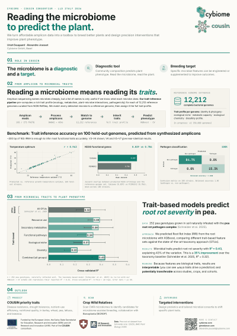
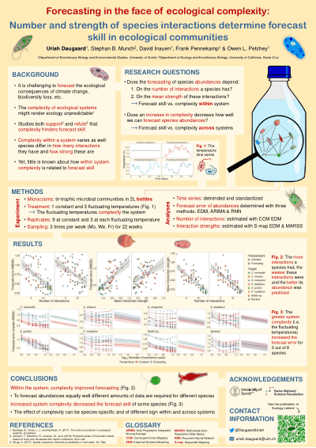
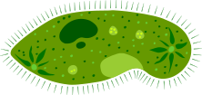
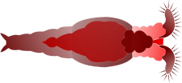

```{=html}
<main>
```

::: {.page-head}
```{=html}
<div class="titles">
```

# Talks & Teaching {.page-title}

```{=html}
<div class="page-sub">invited and contributed talks, posters, and the teaching record</div>
</div>
```

```{=html}
<p class="lead">
A reverse chronological record of where this work has been spoken about, and the courses
I have taught and supported. Where a talk matches a published paper, the paper is on
<a class="inline" href="research.html">Research &amp; Publications</a>.
</p>
```
:::

<!-- Talks -->

::: {.tt-block}
## Talks

```{=html}
<div class="sub">contributed</div>
```

::: {.talks}
```{=html}
<div class="item">
<div class="when">2024</div>
<div class="what">
<strong>To be filled in.</strong>
<span class="where">Placeholder. Talk for 2024 to be added.</span>
</div>
</div>
<div class="item">
<div class="when">2023</div>
<div class="what">
<em>The dependence of forecasts on sampling frequency as a guide to optimizing monitoring in community ecology.</em>
<span class="where"><strong>GfÖ 2023</strong> &middot; 52nd annual meeting of the Ecological Society of Germany, Austria and Switzerland &middot; Leipzig &middot; Sep 12-16 2023.</span>
</div>
</div>
<div class="item">
<div class="when">2022</div>
<div class="what">
<em>Forecasting in the face of ecological complexity: number and strength of species interactions determine forecast skill in ecological communities.</em>
<span class="where"><strong>Biology 2022</strong> &middot; Swiss conference on organismic biology &middot; Basel &middot; Feb 17-18 2022.</span>
</div>
</div>
<div class="item">
<div class="when">2022</div>
<div class="what">
<em>Forecasting in the face of ecological complexity: number and strength of species interactions determine forecast skill in ecological communities.</em>
<span class="where"><strong>SFE² GFÖ EEF</strong> &middot; International Conference on Ecological Sciences &middot; Metz, France &middot; Nov 21-25 2022.</span>
</div>
</div>
<div class="item">
<div class="when">2021</div>
<div class="what">
<em>Non-consumptive and resource-availability effects in a ciliate predator-prey pair.</em>
<span class="where"><strong>ESA 2021</strong> &middot; annual meeting of the Ecological Society of America &middot; virtual &middot; Aug 2-6 2021.</span>
</div>
</div>
<div class="item">
<div class="when">2020</div>
<div class="what">
<em>Warming can destabilize predator-prey interactions by shifting the functional response from Type III to Type II.</em>
<span class="where"><strong>BES 2020</strong> &middot; annual meeting of the British Ecological Society &middot; virtual &middot; Dec 14-18 2020.</span>
</div>
</div>
```
:::

### Posters {style="margin-top:48px"}

::: {.card-grid .poster-grid}
```{=html}
<a class="card" href="assets/docs/COUSIN_Poster_Cybiome_LLD_Italy_2026.pdf" target="_blank" rel="noopener">
<div class="thumb">

</div>
<div class="body">
<div class="meta">2026 <span class="chip gold">first author</span></div>
<h4>COUSIN poster.</h4>
<p class="where"><strong>Let's Liberate Diversity (LLD)</strong> &middot; Italy &middot; 2026 &middot; with Alexandre Jousset &middot; Cybiome / EU Horizon Europe COUSIN consortium.</p>
<span class="chip open">Poster pdf <span class="arrow">↗</span></span>
</div>
</a>
<a class="card" href="assets/docs/PosterEcoForecast.pdf" target="_blank" rel="noopener">
<div class="thumb">

</div>
<div class="body">
<div class="meta">2022 <span class="chip gold">flash talk</span></div>
<h4>Forecasting in the face of ecological complexity: number and strength of species interactions determine forecast skill in ecological communities.</h4>
<p class="where"><strong>INTECOL 2022</strong> &middot; 13th International Congress of Ecology &middot; Geneva &middot; Aug 28 - Sep 2 2022. Selected as one of 10 best posters invited to a flash talk during the opening plenary.</p>
<p class="where again"><span class="again-lbl">same poster, also shown at</span><strong>Ecology Symposium</strong> &middot; hosted by Life Science Zurich Graduate School &middot; Zurich &middot; Oct 12 2022.</p>
<span class="chip open">Poster pdf <span class="arrow">↗</span></span>
</div>
</a>
```
:::
:::

::: {.tt-illu}
```{=html}
<figure>

<div class="cap">Paramecium caudatum</div>
</figure>
<figure>

<div class="cap">Rotifer sp.</div>
</figure>
```
:::

<!-- Teaching -->

```{=html}
<section class="tt-teach">
<h2 style="font-family:'Cormorant Garamond',serif;font-weight:500;font-size:38px;margin:0 0 4px">Teaching</h2>
<div class="sub" style="font-family:'Inter',sans-serif;font-size:11px;letter-spacing:.18em;text-transform:uppercase;color:var(--sage);margin-bottom:24px;font-weight:500">lecturer, head TA, R for biologists</div>
```

::: {.item}
```{=html}
<div class="meta">lecturer
<b>BIO144</b>
<span style="color:var(--ink-3);font-family:'Inter',sans-serif;font-size:11px;font-style:normal;letter-spacing:.06em;display:block;margin-top:4px">UZH · 2024 spring</span>
</div>
```

::: {.body}
**Data analysis in biology.** About 300 second year biology bachelor students per year. Topics include data visualisation and processing, statistical hypothesis testing, linear and logistic and Poisson regression, linear mixed models, intro linear algebra for linear models, goodness of fit. Theoretical lectures paired with practical sessions and flipped classroom videos.

*My role.* Taught four of the theoretical lectures in 2024.
:::
:::

::: {.item}
```{=html}
<div class="meta">teaching assistant
<b>BIO144</b>
<span style="color:var(--ink-3);font-family:'Inter',sans-serif;font-size:11px;font-style:normal;letter-spacing:.06em;display:block;margin-top:4px">UZH · 2021-2023 spring</span>
</div>
```

::: {.body}
Practical exercise support, methodological and computational (R) Q&A, main contact for statistical questions outside class hours, course forum support. Wrote a statistics and computation FAQ for the students proactively.

**Head TA in 2022 and 2023.** Screening of TA candidates, briefing and organisation of the selected TAs, primary TA contact person.
:::
:::

::: {.item}
```{=html}
<div class="meta">short course
<b>R4All</b>
<span style="color:var(--ink-3);font-family:'Inter',sans-serif;font-size:11px;font-style:normal;letter-spacing:.06em;display:block;margin-top:4px">May 12-13 2022</span>
</div>
```

::: {.body}
**An Introduction to the Basics of R.** Two-day course for novice R users with a life and environmental science background.
:::
:::

```{=html}
</section>
</main>
```
